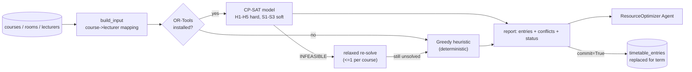

# PHASE 10 — Timetable Optimization (Google OR-Tools)

> Status: **IMPLEMENTED** — full constraint-satisfaction timetable solver with
> OR-Tools CP-SAT and a deterministic greedy fallback. Verified live with OR-Tools
> 9.15 installed. Suite: **26 passed** (4 new optimize tests).
> Code: `backend/app/ml/optimize.py` (used by the Timetable/ResourceOptimizer agent).

---

## 1. Problem statement

Given the course catalog, room inventory, and lecturer assignments, produce a
**conflict-free weekly timetable**: each course gets exactly one session in a
suitable room (size, lab-kind) at a (day, slot) where neither the room nor the
lecturer is double-booked — and where room usage wastes as little capacity as
possible.



---

## 2. Input shaping (`build_input`)

- **Courses**: id, code, title, capacity, `needs_lab` (title contains "lab").
- **Rooms**: id, room_no, capacity, `is_lab` (kind == "lab").
- **Lecturer mapping**: course → lecturer recovered from existing `timetable_entries`;
  courses without one get a deterministic round-robin lecturer. Missing mapping
  never crashes the solver.
- **Existing entries** counted for the report (`existing_entries`).

---

## 3. Constraint model (CP-SAT)

**Variables.** `X[course, room, day, slot] ∈ {0,1}` for every combination that is
already *admissible* (rooms big enough, lab courses restricted to lab rooms at
construction time) — the space pruned before the solver sees it.

### 3.1 Faculty constraints
| ID | Constraint | Type |
|----|-----------|------|
| H5 | a lecturer never teaches **two courses in the same (day, slot)** | hard |
| S3 | a lecturer teaches **at most 2 sessions per day**; overflow is penalized (`over[lecturer, day]` vars) | soft |

### 3.2 Lab constraints
| ID | Constraint | Type |
|----|-----------|------|
| H4 | lab-needed courses are **only** assigned to `kind == "lab"` rooms | hard |
| S2 | non-lab courses **may** use lab rooms, but each use costs the objective | soft |

### 3.3 Room constraints
| ID | Constraint | Type |
|----|-----------|------|
| H2 | **room unary capacity**: at most one course per (room, day, slot) | hard |
| H3 | **size capacity**: `room.capacity ≥ course.capacity` (forbidden at variable creation) | hard |
| S1 | **fit**: using a room more than 2× larger than needed costs the objective | soft |

### 3.4 Course constraints
| ID | Constraint | Type |
|----|-----------|------|
| H1 | every course scheduled **exactly once** (`AddExactlyOne`) | hard |
| H1′ | relaxation pass uses `≤ 1` so the solver can report `unscheduled` instead of aborting | hard(relaxed) |

**Objective (minimize):** `Σ X · (room-fit + lab-use penalties) + Σ over[lecturer, day]`.

**Solve parameters:** `max_time_in_seconds` (default 10), 4 workers; statuses
OPTIMAL / FEASIBLE / INFEASIBLE handled explicitly. INFEASIBLE triggers the
relaxed re-solve, then the greedy fallback.

---

## 4. Greedy heuristic fallback (`_solve_heuristic`)

Used when OR-Tools is absent (`requirements-ml.txt` not installed) or CP-SAT
fails. Deterministic, dependency-free:

1. Sort courses: **lab courses first**, then largest capacity, then code.
2. For each course, scan rooms (sorted by room_no, capacity) × days × slots;
   skip slots violating room unary / lecturer unary / capacity / lab-kind.
3. Pick the lowest-cost placement (same S1–S3 scoring) → book it.
4. Courses with no feasible slot → `unscheduled` (counted as `conflicts`).

Same report shape as CP-SAT, labelled `algorithm="heuristic"`.

---

## 5. Entry point & persistence

```python
solve_timetable(db, *, commit=False, term="2026-S1", time_limit=10.0) -> report
```

- **`commit=False`** (default, safe) — dry-run report only.
- **`commit=True`** — deletes existing `timetable_entries` and persists the solved
  schedule for the term (idempotent).
- **Report** (back-compatible keys for the ResourceOptimizer agent):
  `courses, rooms, slots(20), existing_entries, scheduled, unscheduled[],
  conflicts, algorithm (cp-sat | cp-sat-relaxed | heuristic), status
  (OPTIMAL|FEASIBLE|heuristic), warnings[], entries[]`.

---

## 6. Verified behaviour

| Check | Result |
|-------|--------|
| CP-SAT live run (25 courses, 40 rooms, 2 lecturers, 20 slots) | **FEASIBLE, 25/25 scheduled, 0 conflicts** |
| Hard constraints on output (room unary, capacity, lab-kind, faculty unary, course-once) | all asserted by tests ✅ |
| Commit path persists exactly `n_courses` rows for the term | ✅ |
| Course bigger than every room | reported `unscheduled`, never forced ✅ |
| OR-Tools missing | deterministic greedy, same report shape ✅ |

`tests/test_optimize.py` (4 tests) + full suite **26 passed**.

---

## 7. Implementation order (remaining 🔜)

1. **Real enrollment counts** — replace `course.capacity` with live
   `count(enrollments)` as the class-size for H3/S1.
2. **Multi-session courses** — allow 2–3 sessions/week for labs/tutorials
   (H1 becomes `Exactly(n)` per course).
3. **Instructor preferences** — per-lecturer day/slot availability windows
   (hard) and preferred blocks (soft).
4. **Room kind rules beyond labs** — "lecture hall" only for >60 seats, etc.
5. **Hard priority** — minimise deviation from an existing timetable (delta
   objective) for re-scheduling after a course swap.
6. **Warm start / incremental** — seed the CP-SAT model with the current
   schedule as a hint for faster near-optimal re-solves.
7. **Constraint webhooks** — expose the constraint set as data (not code) so
   the Timetable agent can enforce policy changes without redeploys.

---

## 8. FR traceability

| Requirement | Delivered by |
|-------------|--------------|
| Conflict-free schedules | H1, H2, H5 hard constraints + verification tests |
| Faculty workload sanity | H5 unary + S3 daily-spread objective |
| Lab-aware allocation | H4 hard + S2 soft |
| Room capacity & utilization | H3 hard + S1 fit objective |
| Works without heavy deps | deterministic greedy fallback (same contract) |
| Explainable reports | status/algorithm/warnings + entries preview to the agent |
