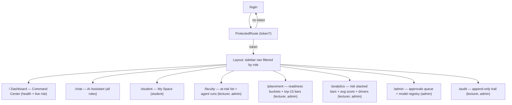
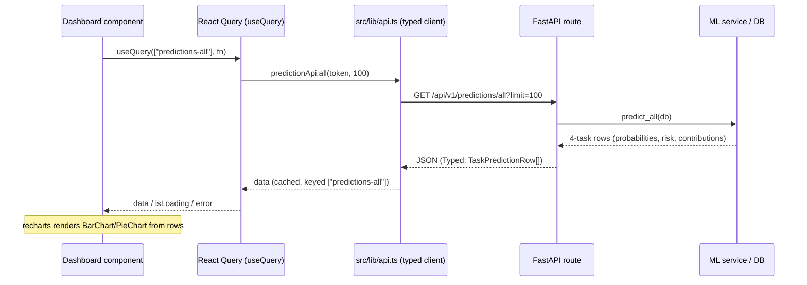

# PHASE 11 — Frontend Dashboards

## Objective

Turn the React + Vite + Tailwind scaffold into a role-aware product: five dashboards
(Student, Faculty, Placement, Admin, Analytics) wired to the FastAPI backend from Phases
5–10, with consistent page structure, a clear state-management split, and a protected,
role-filtered navigation shell.

## Deliverables

| Deliverable | Location | Status |
| --- | --- | --- |
| Role-gated route wrapper | `frontend/src/components/ProtectedRoute.tsx` | done |
| Role-filtered nav + session badge | `frontend/src/components/Layout.tsx` | done |
| API client extensions (models, all-tasks, approvals) | `frontend/src/lib/api.ts` | done |
| Student dashboard | `frontend/src/pages/StudentDashboard.tsx` | done |
| Faculty dashboard | `frontend/src/pages/FacultyDashboard.tsx` | done |
| Placement dashboard | `frontend/src/pages/PlacementDashboard.tsx` | done |
| Admin dashboard | `frontend/src/pages/AdminDashboard.tsx` | done |
| Analytics dashboard | `frontend/src/pages/AnalyticsDashboard.tsx` | done |
| Route wiring | `frontend/src/main.tsx` | done |
| Backend: `GET /api/v1/predictions/all` (all 4 tasks) | `backend/app/api/routes/predictions.py` | done |

## Design Decisions

1. **State-management split** (single source of truth for each concern):
   - *Server state* → **React Query**: every backend resource is a `useQuery` keyed by
     resource name (`["predictions-live"]`, `["models"]`, `["approvals"]`, `["audit"]`).
     Gives caching, deduplication, background refetch and `isLoading`/`error` handling for
     free.
   - *Client/session state* → **Zustand**: only `src/stores/auth.ts` (token, role,
     username). Auth is cross-cutting, tiny and needed by the API client for the
     `Authorization` header — a poor fit for server-state caching. All per-dashboard UI
     state stays in local `useState`/`useQuery` — no global store bloat.
   - This means dashboards never touch the store except to read the token; everything else
     flows through typed API modules in `src/lib/api.ts`.
2. **Role-based access is enforced twice**:
   - Frontend `ProtectedRoute` (`roles` prop) + Layout nav filtering = UX (hide what you
     can't see).
   - Backend `require_role(...)` on every endpoint = security. The frontend gate is a
     convenience, never a trust boundary.
3. **Backend additions kept minimal**: only `/predictions/all` was added (the Analytics and
   Placement dashboards both need per-task rows; `/predictions/live` returns only the
   legacy dropout-style shape). Placement readiness is computed client-side from
   `placement_probability` — no new endpoint needed.
4. **Honest placeholders**: Student dashboard cards for "My courses / attendance /
   academic health" are marked 🔜 because no student-profile endpoints exist yet; the
   pages render the rest of the product without faking data.
5. **One stat-card + content-card grid per dashboard**: each page is `h1` → stat-card row
   (counts/KPIs) → content cards (tables, charts). Charts via `recharts` (already a dep).

## Page structure



## State & data flow



## Route / role matrix

| Route | Page | student | lecturer | admin |
| --- | --- | :-: | :-: | :-: |
| `/` | Dashboard (Command Center) | ✓ | ✓ | ✓ |
| `/chat` | AI Assistant | ✓ | ✓ | ✓ |
| `/student` | Student Dashboard | ✓ | — | — |
| `/faculty` | Faculty Dashboard | — | ✓ | ✓ |
| `/placement` | Placement Dashboard | — | ✓ | ✓ |
| `/analytics` | Analytics Dashboard | — | ✓ | ✓ |
| `/admin` | Admin Dashboard | — | — | ✓ |
| `/audit` | Audit Trail | — | ✓ | ✓ |

## API integration map

| Dashboard | API module | Endpoint(s) |
| --- | --- | --- |
| Student | `agentApi`, `healthApi` | `POST /agents/chat`, `GET /health` |
| Faculty | `predictionApi.live`, `auditApi.list` | `GET /predictions/live`, `GET /audit?action=chat_completed` |
| Placement | `predictionApi.all` | `GET /predictions/all?limit=100` (task=placement) |
| Analytics | `predictionApi.all`, `predictionApi.models` | `GET /predictions/all`, `GET /predictions/models` |
| Admin | `approvalApi.list`, `predictionApi.models`, `healthApi` | `GET /approvals?status=pending`, `GET /predictions/models`, `GET /health` |
| Audit (existing) | `auditApi.list` | `GET /audit?limit=` |

## Verification

```powershell
# frontend
npm run typecheck   # tsc --noEmit -> clean
npm run build       # tsc -b && vite build -> dist/ built OK (27s, 665 kB bundle)

# backend (venv python only; global 3.14 lacks langgraph)
.\.venv\Scripts\python -m pytest -q   # 26 passed (incl. new /predictions/all route import)
```

Build note: single 665 kB bundle triggers Vite's 500 kB chunk warning — acceptable at this
stage; code-splitting via `React.lazy` per dashboard is a documented follow-up.

## Follow-ups

- Student-profile endpoints (`GET /me` academic snapshot) to un-fill the 🔜 cards.
- `React.lazy` route-level code splitting to silence the chunk-size warning.
- Approval *actions* (approve/reject) UI once the 2FA/approval workflow is exercised.
- Timetable visualization for the Phase 10 CP-SAT output (Faculty dashboard).
