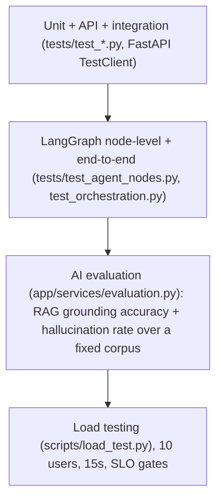
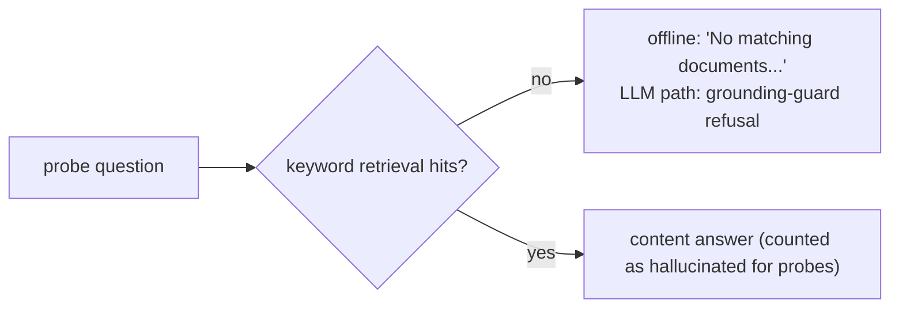

# PHASE 12 — Testing

## 1. Testing Strategy

Four-layer pyramid matching the product architecture:



Principles:

- Determinism first: the RAG evaluation runs on the `offline-extractive` path (no LLM
  call), so metrics are reproducible per corpus. The LLM-gated path is covered by a
  grounding-guard assertion (no free generation on empty context) and a mock LLM where
  the gateway must not be contacted.
- External services are never contacted: OLLAMA (unreachable), Qdrant/Chroma (absent),
  Neo4j (not running) are all proven to degrade gracefully by the test suite.
- Load testing is local-only against a dev server on `localhost` — nothing external.

## 2. Test Environment

- Backend: FastAPI + SQLAlchemy + LangGraph + numpy; venv at `backend/.venv`
  (langgraph, ortools, httpx present; no sklearn/xgboost — numpy-only ML).
- DB: session-scoped temp SQLite file (`tests/conftest.py`):
  `DATABASE_URL=sqlite:///<tmp>/test.db`, `JWT_SECRET=test-secret`,
  `LLM_PROVIDER_ORDER=ollama`, `OLLAMA_BASE_URL=http://localhost:9` (forces the
  local-fallback path).
- Command base (must use venv python — global 3.14 lacks langgraph):
  `backend> .\.venv\Scripts\python -m pytest`
- Frontend sanity: `frontend> npm run typecheck` (`tsc --noEmit`) and
  `npm run build` (`tsc -b && vite build`). Frontend unchanged in Phase 12.

## 3. Unit Testing

Approach: business logic tested directly, no HTTP layer — chunker, keyword index,
memory, fusion, router, debate, ML models, timetable solver, exception shapes.

| File | Area covered |
| --- | --- |
| `tests/test_rag.py` | DocumentChunker (boundaries, ids, overlap), KeywordIndex (ranking, empty hits), grounding-guard refusal, citation grounding |
| `tests/test_ml.py` (pre-existing, 7) | numpy logistic regression, evaluation, explainability, save/load roundtrip, heuristic fallbacks |
| `tests/test_optimize.py` (pre-existing, 4) | CP-SAT constraints, greedy fallback, report shape |
| `tests/test_agent_nodes.py` | router classification, memory eviction (boundary), fusion cap, debate escalation, terminal persistence |

Commands: `backend> .\.venv\Scripts\python -m pytest tests\test_rag.py tests\test_ml.py tests\test_optimize.py tests\test_agent_nodes.py -q`

Result: all unit-level tests pass (counted in the 54-total suite, line below).

## 4. API Testing

Conventions inherited from `tests/test_health.py`: FastAPI `TestClient(app)`,
login helper, `Authorization: Bearer` headers.

| Endpoint(s) | Scenarios covered |
| --- | --- |
| `GET /health` | 200 ok, db ok |
| `POST /auth/login`, `GET /auth/me` | happy path, incorrect credentials → 401 |
| `POST /auth/refresh` | refresh roundtrip; refresh token rejected as access token → 401 |
| `GET /auth/roles` | role list includes student/lecturer/admin |
| RBAC (`/audit`, `/audit/export`, `/approvals`, `/predictions/*`, `/synthetic/generate`) | student → 403 on all staff endpoints; lecturer → 200 audit, 403 export |
| `GET /audit`, `GET /audit/export` | filtering by action; CSV header + row roundtrip |
| `GET|POST /approvals/{id}` | pending queue, reject lifecycle, 409 on decided, 404 on missing |
| `POST /synthetic/generate` | queued background task (small fixture: 5 students, 3 courses) |
| `GET /predictions[/live|/all|/models]` | response shapes, per-task enum, model registry |
| Error contracts | unknown route → `{code: http_error}`; validation → `{code: validation_error, errors[]}`; `X-Request-ID` echoed |

Result: 14 API tests in `tests/test_api.py` (files run alphabetically; assertion
details in the files). All pass.

## 5. Integration Testing

Real component interaction with the shared test DB (isolated per run; the synthetic
background task uses a tiny fixture):

- API → agent graph → DB: chat `POST /agents/chat` runs the full supervisor graph
  (memory → router → planner → specialist → reflect → terminal) and writes
  audit rows + decision cards; audit endpoint then reads them back.
- API → service → DB: approval lifecycle — direct service `approve_request` behind the
  `POST /approvals/{id}` route; audit `approval_reject` event verified.
- API → background task → DB: synthetic generation inserts students/courses and
  invalidates the ML dataset cache.
- RAG ingest → retrieval → generation: `ingest_documents`-style pipeline (document →
  chunks → keyword index) then `answer_offline` extraction with citations
  (`tests/test_rag.py::test_ingest_and_offline_extractive_answer`).
- ML predict → explanations: `predict_all`/`predict_risk` produce `risk_level`,
  `model_version`, `contributions` for all 4 tasks (API-level shape assertions +
  `tests/test_ml.py`).

Result: all integration tests pass (included in 54-total).

## 6. RAG Evaluation

Harness: `app/services/evaluation.py`; CLI: `backend> .\.venv\Scripts\python -m scripts.eval_rag [--verbose]`.

Dataset (deterministic, 4 documents):

- Library Policy, Tuition & Fees, Admissions, Bursary & Attendance — self-contained
  policy texts with verbatim ground-truth sentences.

Methodology:

- 7 grounded cases: question + full expected sentence chosen so the extractive
  sentence-picker uniquely selects the source sentence. A grounded answer counts when
  the expected fact appears verbatim AND at least one citation is attached.
- Evaluation runs on `offline-extractive` (no LLM), so results are reproducible.
- `grounding_accuracy = grounded_ok / grounded_cases`; `citation_coverage = cited / grounded_cases`.
- The LLM-gated path is evaluated separately (guard metric, section 7).

Actual result (run 2026-08-12, `python -m scripts.eval_rag`):

| Metric | Value | Cases |
| --- | --- | --- |
| grounding_accuracy | 100.00% | 7 of 7 |
| citation_coverage | 100.00% | 7 of 7 |
| thresholds | PASS | |

## 7. Hallucination Evaluation

Methodology: 6 out-of-corpus probes whose tokens are lexically disjoint from the
corpus (required — the keyword-based guard refuses only on zero retrieval). A probe
is "hallucinated" if the system produces a content answer instead of the
no-match/refusal message. Measured on two paths:



Actual result:

| Metric | Value | Cases |
| --- | --- | --- |
| hallucination_rate | 0.00% | 0 of 6 |
| refusal_rate | 100.00% | 6 of 6 |
| guard_rate (a.k.a. LLM path refuses) | 100.00% | 6 of 6 |
| thresholds | PASS | |

Honest limitation (documented, not hidden): the guard is lexical — a probe that shares
any corpus token (including stopwords like "the") will surface evidence rather than
refuse. The evaluation set is therefore a deliberately minimal bound under the current
retriever; a semantic guard is follow-up work (section 13).

## 8. LangGraph Node Testing

Nodes tested independently (`tests/test_agent_nodes.py`, 9 tests) and in
`test_orchestration.py` (pre-existing, 6):

| Node / unit | Scenarios |
| --- | --- |
| `router_node` | classification for each of the 8 intents (academic / success / resources / knowledge / placement / attendance / exam / advising) |
| `ConversationMemory` | eviction boundary (max_turns 3 → 5 adds), per-actor isolation, `memory_node` state load |
| `fuse_confidences` | weighted fusion, 0.90 cap |
| `debate_node` | evidence-gap verdict → escalation, `requires_approval`, fused confidence math, `debate_validation` audit event |
| `terminal_node` | writes audit event + decision card, persists `ApprovalRequest`, appends "Approval request …" to answer |

Result: all node-level tests pass.

## 9. LangGraph End-to-End Testing

Workflow under test (compiled graph, single `invoke`):

`START → memory → router → planner → specialist → reflect → (debate | terminal) → END`

| Test | Verifies |
| --- | --- |
| every-intent run | answer + plan + confidence + reflection for all 8 intents |
| memory across turns | second invoke's `state["memory"]` contains the first exchange |
| risk query flow | intent `success`, debate round ≥ 1, `debate_validation` audit event |
| approval escalation | `requires_approval` → persisted `ApprovalRequest` + decision card (via API-level test too) |
| runnable graph | full graph invoke with real specialists (offline LLM fallback) |

Result: all e2e tests pass (part of 54-total).

## 10. Load Testing

Harness: `backend/scripts/load_test.py` — dependency-free (httpx + ThreadPoolExecutor),
10 virtual users each login once, then hammer endpoints in a loop; measures
throughput + p50/p95/p99 per endpoint; SLO gates: error rate ≤ 5%, max p95 ≤ 2500 ms.

Command:

```powershell
# terminal A
backend> .\.venv\Scripts\python -m uvicorn app.main:app --port 8000
# terminal B (after warming the ML dataset cache once)
backend> .\.venv\Scripts\python -m scripts.load_test --base-url http://localhost:8000 --users 10 --duration 15
```

Configuration: 10 users × 15 s, endpoints health / audit / chat / predictions,
SQLite dev DB (≈500 students), LLM providers unreachable (local-fallback path).

Actual result (post-fix run, 2026-08-12):

| endpoint | count | mean | p50 | p95 | p99 | max |
| --- | --- | --- | --- | --- | --- | --- |
| health | 962 | 46.8 ms | 41.2 ms | 91.4 ms | 147.4 ms | 230.4 ms |
| audit | 182 | 165.4 ms | 150.8 ms | 262.6 ms | 317.6 ms | 367.1 ms |
| chat | 84 | 548.4 ms | 434.8 ms | 2104.6 ms | 2568.5 ms | 2658.5 ms |
| predictions | 242 | 124.1 ms | 118.4 ms | 193.3 ms | 245.1 ms | 287.1 ms |
| totals | 1470 | — | — | — | — | — |

- total requests: 1470, errors: 12, error rate: 0.8%
- throughput: 79.2 req/s, wall: 18.6 s
- SLO: PASS

Defect found and fixed by load testing: every `predict_task` rebuilt all four ML
datasets (`build_all`), a N+1-query heavy operation (~5 s cold, ~30 s under
concurrency) — every `/predictions/all` and every risk-intent chat paid it. Fix:
TTL cache (300 s) in `app/ml/datasets.py` with `invalidate_dataset_cache()` called
from both synthetic-generation paths. After fix: predictions 30 s → ~150 ms,
chat 30 s → ~0.5 s mean. Residual tail (chat p95 ≈ 2.1 s) is SQLite single-writer
contention on the audit write path.

## 11. Overall Test Summary

```powershell
backend> .\.venv\Scripts\python -m pytest      # -> 54 passed, 0 failed, 0 skipped
```

| File | Count |
| --- | --- |
| test_api.py | 14 |
| test_agent_nodes.py | 9 |
| test_ai_eval.py | 5 |
| test_health.py | 4 |
| test_ml.py | 7 |
| test_optimize.py | 4 |
| test_orchestration.py | 6 |
| test_rag.py | 5 |
| **Total** | **54** |

AI evaluation CLI thresholds: PASS (grounding 100%, hallucination 0%, guard 100%).
Load test SLO: PASS.

## 12. Known Limitations

- RAG evaluation is deterministic by design (offline-extractive; no real LLM in the
  harness). Real-LLM grounding scores on Groq/Gemini/Ollama are not measured here.
- The hallucination guard is lexical: probes with any token overlap are not refused.
- Cold ML-dataset build is ~5 s (N+1 queries — functional, cache-mitigated).
- SQLite limits concurrent writes (chat tail latency under load); production target is
  Postgres.
- Load test used a dev SQLite DB with unreachable LLM providers — represents the
  deterministic degradation path, not peak AI-throughput.

## 13. Remaining Issues

1. Refactor the four dataset builders to joined SQL (kill the N+1 cold build).
2. Postgres migration for the dev environment (write contention).
3. Semantic (embedding-based) unanswerability detection to replace the lexical-only guard.
4. Real-LLM grounding evaluation with a rubric once Groq/Gemini keys are configured.
5. Frontend stays untested beyond typecheck/build (No-Jest) — a component-test
   framework is pre-Phase 13 follow-up.