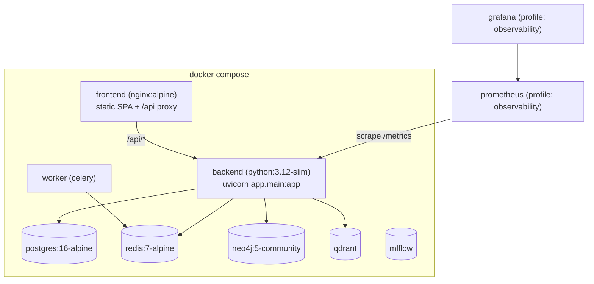
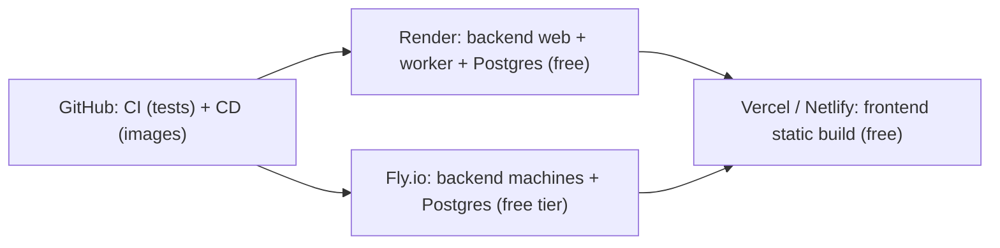

# PHASE 13 — Deployment

## 1. Objectives

- Containerize backend + frontend (Docker / Docker Compose) and prove the stack boots
  end-to-end with real containers.
- CI/CD for GitHub Actions (lint+test+build on push/PR; image publishing on main).
- Free-tier deployment recipes: Render / Fly.io (backend) + Vercel / Netlify (frontend).
- Environment variables, observability (Prometheus + Grafana), Sentry error tracking.

## 2. Inventory (what existed vs. what Phase 13 adds)

| Artifact | Status before | Phase 13 |
| --- | --- | --- |
| `docker-compose.yml` (postgres, redis, neo4j, qdrant, mlflow, backend, worker, frontend + observability/ollama profiles) | existed | grafana provisioning mounts added |
| `backend/Dockerfile`, `frontend/Dockerfile`, `frontend/nginx.conf` | existed | ortools step + `.dockerignore` ×2 |
| `.github/workflows/ci.yml` | existed | ML dep for tests, `pytest -q` |
| `deploy/prometheus.yml`, `.env.example` (`SENTRY_DSN`) | existed | unchanged |
| Sentry wiring (`sentry_sdk` init in `app/main.py` lifespan, `settings.sentry_dsn`) | existed | verified + documented |
| — | — | `docker-compose.local.yml` (port override for conflicting hosts) |
| — | — | `cd.yml` (GHCR images + deploy-hook dispatch) |
| — | — | `render.yaml`, `fly.toml`, `vercel.json`, `netlify.toml`, `frontend/.env.example` |
| — | — | `deploy/grafana/provisioning/*` + `deploy/grafana/dashboards/beru-overview.json` |

## 3. Environment Variables

`backend/app/config.py` is pydantic-settings; every value is env-overridable and loaded
from a root `.env` (`SettingsConfigDict(env_file=".env")`). Reference plan in
`.env.example`. Runtime-critical variables:

| Variable | Purpose | Required |
| --- | --- | --- |
| `SECRET_KEY` | JWT signing | **yes** (generate in production: `openssl rand -hex 32`) |
| `DATABASE_URL` | sqlalchemy URL (sqlite dev / `postgresql+psycopg2://` prod) | **yes** |
| `DEFAULT_ADMIN_PASSWORD` | seeded admin on first boot | **yes** (rotate after first login) |
| `APP_ENV` / `DEBUG` | environment + debug flags | no (defaults development/true) |
| `GROQ_API_KEY`, `GEMINI_API_KEY`, `OLLAMA_BASE_URL` | LLM chain; empty/unreachable degrades to rule-based fallback | no |
| `REDIS_URL`, `NEO4J_URI`, `QDRANT_URL`, `MLFLOW_TRACKING_URI` | optional infra; graceful degradation | no |
| `SENTRY_DSN` | error tracking (`sentry_sdk.init` runs only when set) | no |
| `VITE_API_URL` (frontend build-time) | API base; unset → same-origin `/api` | no |

## 4. Docker

Architecture:



- **backend image**: `python:3.12-slim`, installs `requirements.txt` + `ortools` only
  (keeps the CP-SAT solver fully functional without the heavy `requirements-ml.txt`
  extras → lean image). `.dockerignore` excludes venv/tests/.env/db files.
- **frontend image**: multi-stage — `node:22-alpine` build → `nginx:alpine`; SPA
  fallback + `/api/` proxy to the backend service.
- Compose services: postgres (healthcheck), redis (healthcheck), neo4j, qdrant,
  mlflow, backend (depends on healthy postgres/redis), worker (celery), frontend;
  `--profile observability` adds Prometheus + Grafana; `--profile ollama` adds a local
  LLM.

Commands:

```powershell
# full stack (standard ports)
docker compose up -d --build
# host with 6379 already taken by another project
docker compose -f docker-compose.yml -f docker-compose.local.yml up -d --build
# monitoring
docker compose -f docker-compose.yml -f docker-compose.local.yml --profile observability up -d
```

Verified (2026-08-12, real containers):

```text
beru-postgres  Up (healthy)   0.0.0.0:5432->5432
beru-redis     Up (healthy)   0.0.0.0:6380->6379   (override; host 6379 in use)
beru-neo4j     Up             7474/7687
beru-qdrant    Up             6333/6334
beru-backend   Up             8000
beru-frontend  Up             5173->80
beru-prometheus Up (observability)  9090
beru-grafana    Up (observability)  3000
```

Endpoint checks (all against the containerized stack):

| Check | Result |
| --- | --- |
| `GET /api/v1/health` | `{"status":"ok",...,"db":"ok"}` on **PostgreSQL** |
| `GET /metrics` | `beru_http_requests_total{path="/api/v1/health",status="200"} 2` |
| `POST /auth/login` + `GET /auth/me` | JWT issued, `role=admin` |
| `GET http://localhost:5173/` | SPA served by nginx |
| `GET http://localhost:5173/api/v1/health` | nginx proxy → backend ok |
| `GET http://localhost:5173/analytics` | SPA fallback → index.html |

**Defect found & fixed by containerization**: `app/main.py` annotated `/metrics`
with `-> Response` imported function-locally. Python 3.14 (dev venv) evaluates
annotations lazily so it booted locally, but Python 3.12 (image + CI) raised
`NameError: name 'Response' is not defined` at import → `/metrics` broke the whole
app in production Python. Fixed by hoisting the import to module level.

## 5. CI/CD (GitHub Actions)

`ci.yml` — on push to `main` and PRs:

- **backend**: `actions/setup-python@v5` (3.12, pip cache) →
  `pip install -r requirements.txt "ortools>=9.10"` (fixed in Phase 13: without
  ortools the Phase-10 timetable tests fail) → `compileall` → `pytest -q`.
- **frontend**: Node 22 + npm cache → `npm run typecheck` → `npm run build`.
- **docker**: `docker compose config --quiet` (config drift guard).

`cd.yml` — on push to `main` (or `workflow_dispatch`): builds and pushes
`ghcr.io/<owner>/beru-backend[-frontend]:latest + :<sha>`, then triggers the
provider deploy hook (Render deploy hook / `flyctl deploy`) when the matching secret
is set. See secrets list + full provider flows in: `cd.yml`, `render.yaml`, `fly.toml`.

## 6. Free-tier production deployment



- **Render** (`render.yaml` blueprint): web service (uvicorn :10000, health check
  `/api/v1/health`), worker (celery), free Postgres. Secrets via dashboard
  (`SECRET_KEY` auto-generated, `SENTRY_DSN`, `GROQ_API_KEY`, `GEMINI_API_KEY`).
- **Fly.io** (`fly.toml`): `app` process = uvicorn; `worker` process = celery;
  Postgres attached service on the internal network; `auto_stop_machines` keeps the
  free allowance small.
- **Vercel** (`frontend/vercel.json`): Vite SPA + `/* → /index.html` rewrite.
  Same-origin `/api` assumed; for a remote API set `VITE_API_URL=<backend>` at build
  time (backend CORS is `allow_origins=["*"]`).
- **Netlify** (`netlify.toml`): builds `frontend/`, publishes `dist`, proxies
  `/api/*` → backend (edit the target URL), SPA fallback.

## 7. Observability

- **Prometheus** (`deploy/prometheus.yml`): scrape job `beru-backend` →
  `backend:8000/metrics` (target resolved over the compose network), 15 s interval.
- **Grafana**: auto-provisioned on boot — Prometheus datasource
  (`deploy/grafana/provisioning/datasources/beru-datasource.yml`) and dashboard
  provider (`deploy/grafana/provisioning/dashboards/beru-dashboards.yml`) loading
  `deploy/grafana/dashboards/beru-overview.json` (request rate total / by status /
  by endpoint, total counter). Backend exposes `beru_http_requests_total{method,
  path, status}` (prometheus-client, `app/main.py`).
- Verified live: Prometheus `up=1`, 4 series of `beru_http_requests_total`
  (e.g. `path="/api/v1/health",status="200"} 2`); Grafana REST
  `/api/datasources` lists the provisioned Prometheus and `/api/search`
  returns the "Beru Campus AI – API overview" dashboard.
- **Sentry**: `sentry_sdk` is initialized in the FastAPI lifespan only when
  `SENTRY_DSN` is set (self-hosted / free tier 5k events/mo); errors flow through
  the global exception handlers with `X-Request-ID` context.

## 8. Commands reference

```powershell
# build + run everything
docker compose up -d --build
# logs
docker compose logs -f backend
# monitoring stack
docker compose --profile observability up -d
# teardown (keeps named volumes for postgres etc.)
docker compose down
# ci parity (local)
backend> .\.venv\Scripts\python -m pytest -q
frontend> npm run typecheck; npm run build
```

## 9. Known limitations

- Free-tier platforms sleep instances under no traffic (Render free / Fly auto-stop) —
  cold starts add seconds.
- Render `render.yaml` `REDIS_URL` points at a loopback default; Celery workers require
  a real Redis to activate (add a free Redis provider or disable the worker on free tier).
- Vercel does not proxy external APIs — cross-origin requires `VITE_API_URL` at build
  time (documented above).
- `docker-compose.local.yml` uses the Compose `!override` tag (Compose ≥ 2.24) — not
  understood by plain YAML parsers; `docker compose config` is the validator of record.
- The image runs with SQLite when `DATABASE_URL` is unset (per-volume file) — compose
  overrides it to PostgreSQL.

## 10. Follow-ups

- Postgres migrations (alembic) for schema drift control.
- `docker compose --profile ocr`-style production profile with Traefik/Caddy + TLS.
- Redis/TLS secrets rotation via provider dashboards.
- Structured (JSON) logging for Grafana Loki when a log store is added.