# PHASE 2 — System Design

## Beru Campus AI — Autonomous Multi-Agent University Operating System

| Field | Value |
|---|---|
| Project | Beru Campus AI |
| Phase | Phase 2 — System Design |
| Document Version | 1.0 |
| Status | Draft |
| Last Updated | 2026-08-11 |
| Prerequisite | docs/PHASE1_Requirement_Analysis.md |

**Scope of this document:** High-Level Architecture, Low-Level Architecture, Component Diagram, Deployment Diagram, Sequence Diagrams, Class Diagram, ER Diagram, and Data Flow Diagram — all in Mermaid, explained component by component, mapped to the approved free stack (Groq/Gemini + Ollama fallback, Qdrant/Chroma retrieval, LangGraph, FastAPI, PostgreSQL, Neo4j, Redis, Celery, Docker Compose, Prometheus/Grafana, Sentry).

---

## 1. Design Goals & Principles

| # | Principle | Consequence in design |
|---|---|---|
| P1 | **Zero-cost by default** | Every heavy service has a local fallback (Ollama for LLM, ChromaDB for Qdrant, SQLite fallback only for dev if needed). |
| P2 | **Graceful degradation** | The LLM Gateway implements a deterministic fallback chain: Groq → Gemini → Ollama. If the network dies, the system still answers locally. |
| P3 | **Human-in-the-loop for high impact** | Every mutating/high-stakes action passes an approval gate; the graph pauses and resumes. |
| P4 | **Everything is audited** | A single Audit Interceptor wraps all agent actions, LLM calls, predictions, and approvals (hash-chained, append-only). |
| P5 | **Agents are stateless; state lives in the graph** | LangGraph holds shared `AgentState`; agents are pure functions over that state. |
| P6 | **Asynchronous by default** | Long tasks (data generation, training, timetabling, notifications) run on Celery workers, never in the HTTP path. |
| P7 | **Single source of truth + read models** | PostgreSQL is the transactional source of truth; Neo4j (graph), Qdrant (vectors), Redis (cache/queue) are derived read-optimized stores. |

---

## 2. High-Level Architecture

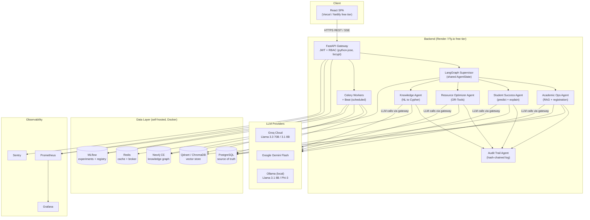

### Component-by-component explanation (HLA)

| Component | Role in the system | Free-stack mapping |
|---|---|---|
| **React SPA** | The only user surface. Three role views (Student Portal, Lecturer Console, Admin Command Center) render from REST + Server-Sent Events. | React, Vite, shadcn/ui, Tailwind, Zustand, React Query, Recharts |
| **FastAPI Gateway** | Single entry point. Authenticates (JWT), enforces RBAC, validates Pydantic schemas, streams agent responses via SSE, and forwards long tasks to Celery. | FastAPI, python-jose, passlib/bcrypt |
| **LangGraph Supervisor** | Orchestrator. Receives an intent from the gateway, selects the specialist agent, threads a shared `AgentState` between agents, and manages approval gates. It is the only component that talks to all agents. | LangGraph |
| **Specialist Agents (A1–A4)** | Each encapsulates one domain: academic operations (registration/reports/RAG Q&A), student success (prediction + intervention drafting), resource optimization (timetabling), and knowledge-graph querying. All read/write the same stores but own different business rules. | LangGraph nodes, LangChain tools |
| **Audit Trail Agent** | Cross-cutting. Every agent emits audit events; this agent persists them append-only with hash chaining and assembles "Decision Cards". Never on a hot path; writes are async. | PostgreSQL (append-only tables), FastAPI events |
| **Celery Workers + Beat** | Execute long-running jobs (synthetic data generation, model training, timetable solving, scheduled re-scoring of students, notifications) off the HTTP path. | Celery, Redis broker |
| **PostgreSQL** | Transactional source of truth: users, enrollments, grades, attendance, audit logs, decisions, model metadata. | PostgreSQL 16 (self-hosted) |
| **Neo4j** | Knowledge graph: entities (Student, Course, Lecturer, Room, Department) and relationships (enrolls, teaches, prerequisite, scheduled_in). Powers cross-domain questions. | Neo4j Community Edition |
| **Qdrant / ChromaDB** | Vector index over institutional documents and (optionally) course material embeddings. Qdrant is primary; ChromaDB is the embedded fallback when Qdrant is down. | Qdrant (Docker) / ChromaDB (embedded) |
| **Redis** | Celery broker + result backend, JWT blacklist/rate-limits, and pub/sub for live dashboard events. | Redis 7 |
| **MLflow** | Tracks experiments, registers models, stores SHAP baselines. | MLflow (self-hosted) |
| **LLM Providers** | Reasoning engines. Order: Groq (fast, free quota) → Gemini Flash (second quota pool) → Ollama (local, always available). | Groq, Gemini, Ollama |
| **Prometheus / Grafana / Sentry** | Pull metrics from API + workers; dashboards; error tracking. | Prometheus, Grafana, Sentry free tier |

---

## 3. Low-Level Architecture

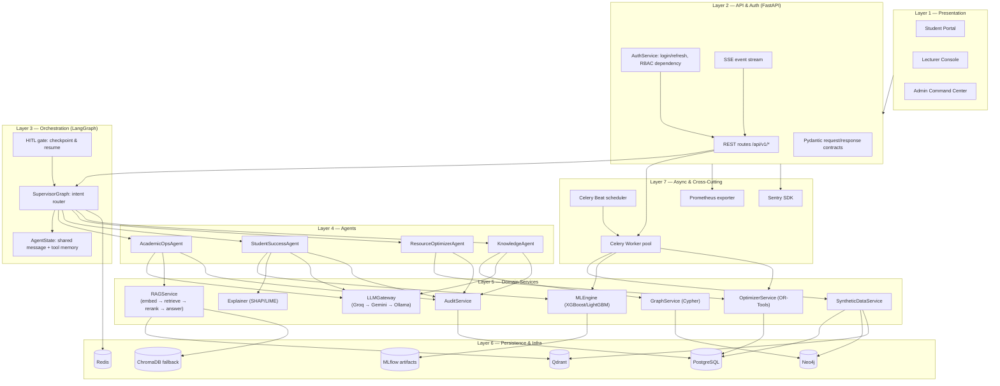

### Layer-by-layer explanation

| Layer | Contents | Explanation |
|---|---|---|
| **L1 Presentation** | 3 role-based React views | Views differ only in data they may request; the backend enforces RBAC, so the SPA never trusts the client. |
| **L2 API & Auth** | REST + SSE + contracts | Every route has a Pydantic contract. `AuthService` issues JWTs and the RBAC dependency rejects unauthorized calls before any agent runs. Long-running agent turns stream tokens over SSE. |
| **L3 Orchestration** | Supervisor graph + state | The `SupervisorGraph` is a LangGraph state machine: nodes are the four agents, edges are intent decisions. `AgentState` carries the conversation, tool results, and gate flags. When an agent requests approval, the graph **checkpoints** (LangGraph persistence) and sleeps until an admin decision resumes it. |
| **L4 Agents** | 4 specialists | Each agent is a graph node with its own tool set. No agent calls another agent directly — all routing goes through the supervisor, keeping the system a strict hierarchy (easier to audit and test). |
| **L5 Domain Services** | Reusable, agent-agnostic services | `LLMGateway` (fallback chain), `RAGService` (retrieval pipeline), `MLEngine` + `Explainer` (prediction + SHAP/LIME), `OptimizerService` (OR-Tools), `GraphService` (Cypher), `SyntheticDataService`, `AuditService`. Services are shared between agents and Celery tasks — this is what keeps code DRY. |
| **L6 Persistence** | 4 DBs + artifacts | Postgres = truth, Neo4j = relationships, Qdrant = embeddings (Chroma fallback), Redis = queue/cache/events, MLflow = experiment artifacts. |
| **L7 Async & Cross-Cutting** | Celery + observability | Celery workers run all heavy tasks. Prometheus exports `/metrics`; Sentry captures exceptions. |

---

## 4. Component Diagram

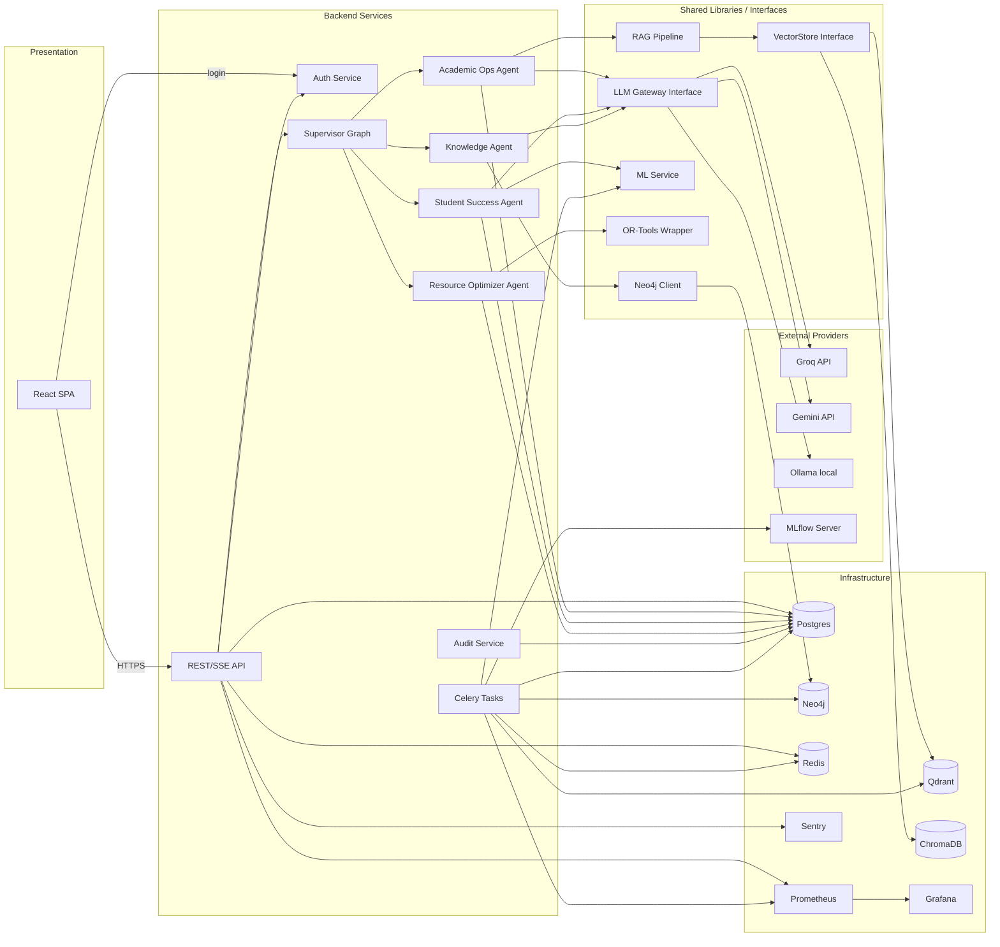

### Interfaces (contracts between components)

| Interface | Direction | Transport | Payload example |
|---|---|---|---|
| `POST /api/v1/auth/login` | SPA → Auth | REST | `{username, password}` → `{access_token, refresh_token}` |
| `POST /api/v1/agents/chat` | SPA → API | REST + SSE | `{message}` → streamed tokens + final `DecisionCard` |
| `POST /api/v1/approvals/{id}` | SPA → API | REST | `{decision: approve/reject, comment}` |
| `GET /api/v1/audit?filters` | SPA → API | REST | filter params → paginated audit rows |
| `LLMGateway.complete()` | Agent → LLM GW | in-process | `(messages, tools)` → `(response, provider_used, cost, latency)` |
| `VectorStore.search()` | RAG → Qdrant/Chroma | gRPC/REST or embedded | `(query_embedding, top_k)` → scored docs |
| `GraphService.query()` | Agent → Neo4j | Bolt | `(cypher, params)` → records |
| `broker.publish()` | API/Worker → Redis | RESP | JSON job payload |
| `/metrics` | API/Worker → Prometheus | HTTP scrape | Prometheus text format |

---

## 5. LLM Fallback & RAG Retrieval Paths

### 5.1 LLM Gateway fallback chain

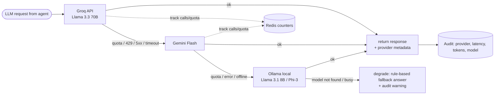

**Fallback rules:** the gateway tries providers in order (Groq → Gemini → Ollama). It only falls through on hard failures (HTTP ≥ 400, quota, timeout > N s). A **circuit breaker** trips a provider for 60 s after 3 consecutive failures, skipping it immediately. Usage counters in Redis keep the system under free-tier quotas (e.g., "stop using Gemini after X requests/hour"). Every call is audited with `provider_used`, latency, and token counts so the FYP report can show cost and resilience data.

### 5.2 RAG retrieval flow (Qdrant primary → Chroma fallback)

```mermaid
flowchart LR
    Q["user question"] --> EMB["Embedder<br/>BAAI/bge-small-en-v1.5<br/>(local, ONNX/SentenceTransformers)"]
    EMB --> VEC["query vector (384-dim)"]
    VEC --> QD["Qdrant<br/>hnsw search, top-k=20"]
    QD -->|"qdrant healthy"| CAND["20 candidate chunks"]
    QD -.->|"qdrant down"| CH["ChromaDB fallback<br/>(same embedding, same top-k)"]
    CH --> CAND
    CAND --> RR["Reranker<br/>bge-reranker-base (local)"]
    RR --> TOP["top-4 chunks, re-scored"]
    TOP --> LLM2["LLM Gateway: answer with citations"]
    LLM2 --> ANS["final answer + [source] refs"]
    ANS --> AUD2[("Audit: sources, scores, provider")]
```

**Retrieval explanation:** the query is embedded locally (never sent to an API, so retrieval works offline). Qdrant returns 20 candidate chunks (recall-biased), the local reranker re-scores and keeps 4 (precision-biased), and the LLM is prompted with only those 4 chunks plus an instruction to cite them. The answer surface includes source IDs so the UI can link back to the original document. If Qdrant is unreachable, the same `VectorStore` interface switches to ChromaDB (embedded, zero extra infra) — this satisfies the "retrieval still works on a plane" requirement.

---

## 6. Sequence Diagrams

### 6.1 Student Q&A (RAG) with audit

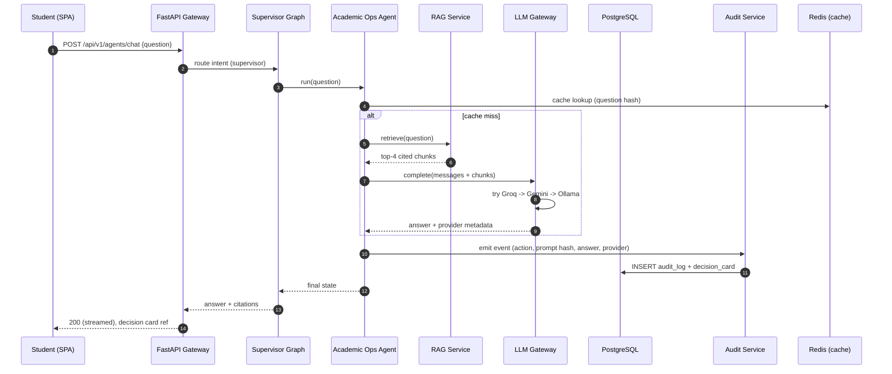

### 6.2 Registration with Human-in-the-Loop gate

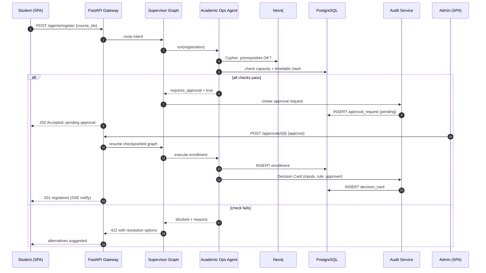

### 6.3 Scheduled risk prediction

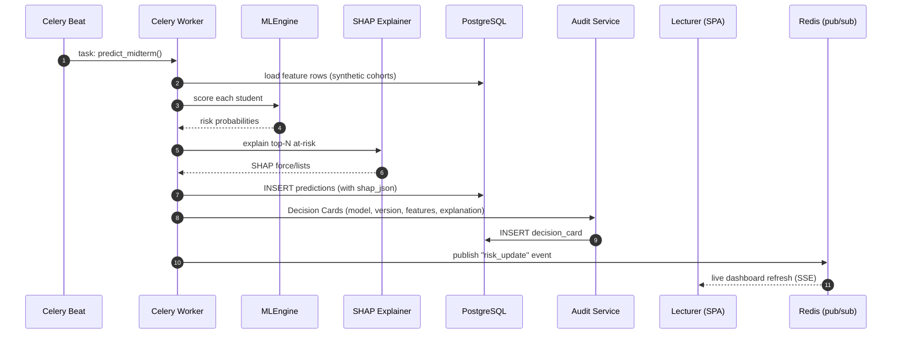

---

## 7. Deployment Diagram

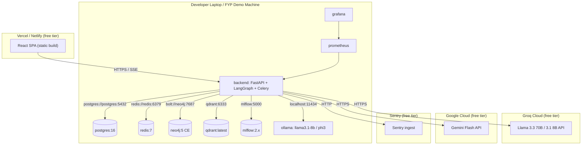

### Deployment notes (component by component)

| Deployable | Host | Notes |
|---|---|---|
| **React SPA** | Vercel/Netlify free | Static build; talks to the backend URL from `VITE_API_URL` env. |
| **FastAPI + LangGraph + Celery** | Render free (web + worker services) or Docker on demo laptop | Same image; web service runs Uvicorn, worker service runs `celery -A app.workers.celery_app worker`. On Render the free web service sleeps after inactivity — acceptable for demo; the laptop stack is the primary defense environment. |
| **PostgreSQL, Redis, Neo4j, Qdrant, MLflow, Prometheus, Grafana, Ollama** | Local Docker Compose | Not hosted on free clouds — too heavy/costly; all run via `docker compose up` and are reachable by the backend on the compose network. |
| **Groq / Gemini APIs** | External clouds | Zero cost within free quotas; used only when online. |
| **Ollama** | Local laptop | The offline guarantee: answers, embeddings, and reranking all work with zero internet. |
| **Sentry** | Cloud free tier | Error capture; DSN optional (disabled if unset). |

---

## 8. Class Diagram (Core Backend)

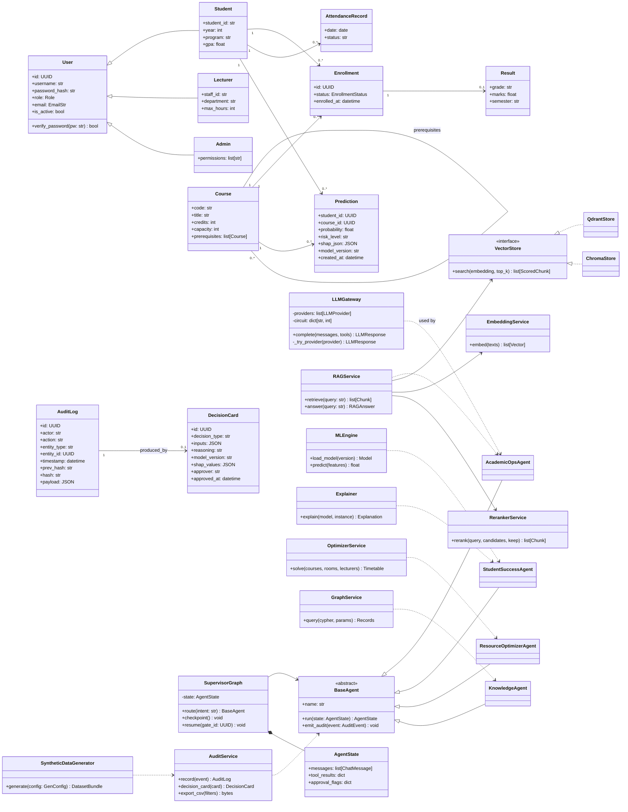

### Class-diagram notes

- **BaseAgent** is the contract every agent implements (`run(state) -> state`); `SupervisorGraph` only depends on `BaseAgent`, so adding a 5th agent later requires zero changes to the orchestrator (satisfies NFR extensibility).
- **AuditService** is referenced by every agent (the audit interceptor), guaranteeing 100% coverage of actions.
- **VectorStore** is an interface implemented by `QdrantStore` (primary) and `ChromaStore` (fallback) — this is the abstraction that makes the Qdrant/Chroma switch a one-line config change.
- **LLMGateway** hides provider logic; agents never import Groq/Gemini/Ollama SDKs directly.
- ER-style relationships (User/Student/Enrollment…) mirror the PostgreSQL schema in section 9.

---

## 9. ER Diagram (PostgreSQL Schema)

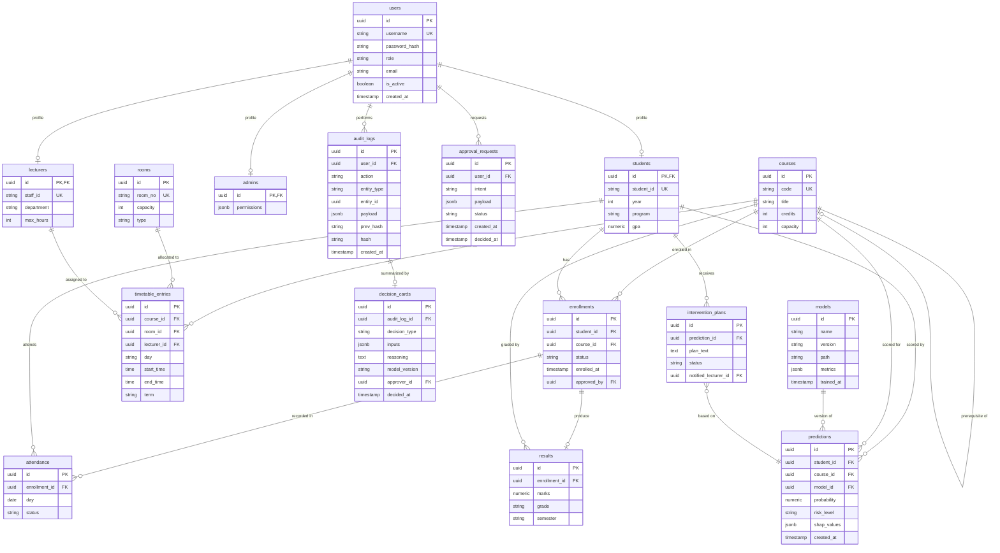

### ER explanation

| Entity | Purpose | Key notes |
|---|---|---|
| `users` + `students/lecturers/admins` | Auth + role profiles | Single-table `users` with polymorphic profiles (1:0..1). Simplest RBAC for an FYP; `role` field + profile FK. |
| `courses` | Catalog | Self-referencing FK `prerequisite_of` captures prerequisites in relational form (mirrored in Neo4j for traversal). |
| `enrollments` | Registration | `status` = pending/approved/rejected; `approved_by` records the HITL approver — this is how the audit chain is kept complete. |
| `results`, `attendance` | Academic history | Keyed by enrollment; feeds the ML feature set. |
| `rooms`, `timetable_entries` | Resource state | Solver output lands here; conflicts are impossible post-optimization but the solver validates before write. |
| `predictions`, `intervention_plans` | ML outputs | `shap_values` stored as JSON so every prediction is self-explanatory; `model_id` ties to `models` for reproducibility (MLflow version). |
| `audit_logs`, `decision_cards`, `approval_requests` | Governance | Append-only `audit_logs` with `prev_hash`/`hash` hash-chaining (tamper-evidence). `decision_cards` summarize *why*; `approval_requests` link the HITL gate. |
| `models` | ML registry mirror | Points at MLflow artifact paths; keeps the DB queryable without contacting MLflow. |

---

## 10. Data Flow Diagram

### 10.1 Context Diagram (DFD Level 0)

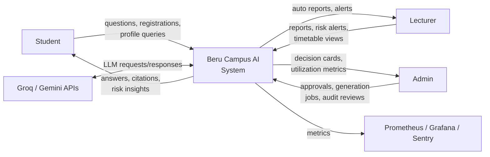

### 10.2 Level 1 DFD

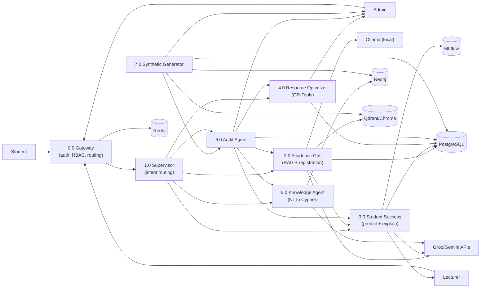

### DFD explanation

| Process | Inputs | Outputs | Store touched |
|---|---|---|---|
| **0.0 Gateway** | login, chat messages, job requests | routed intents, tokens, errors | Redis (rate limit, cache) |
| **1.0 Supervisor** | intents from gateway | dispatched agent runs, approval gates | — |
| **2.0 Academic Ops** | questions, registration requests | answers with citations, enrollments, audit events | Postgres, Qdrant/Chroma, LLMs |
| **3.0 Student Success** | feature rows (from Postgres) | risk scores, SHAP explanations, intervention plans, lecturer alerts | Postgres, MLflow |
| **4.0 Resource Optimizer** | course/room/lecturer data | timetable rows, conflict report, utilization metrics | Postgres |
| **5.0 Knowledge Agent** | NL queries | Cypher-generated answers, graph results | Neo4j |
| **6.0 Audit Agent** | events from all processes | append-only logs, Decision Cards, CSV exports | Postgres |
| **7.0 Synthetic Generator** | config (size, seed) | populated datasets in all stores, generation report | Postgres, Neo4j, Qdrant |

All processes emit to 6.0 (audit) — the audit agent is deliberately drawn as a sink connected to every process to make the guarantee explicit.

---

## 11. Cross-Cutting Design Decisions

| Concern | Decision | Why |
|---|---|---|
| LLM failure | Fallback chain Groq → Gemini → Ollama + circuit breaker | Zero-cost + offline resilience; audited provider metadata for the report |
| Retrieval failure | `VectorStore` interface; Qdrant primary, Chroma embedded fallback | Same pipeline code, one config switch |
| Data consistency | Postgres = truth; Neo4j/Qdrant rebuilt from Postgres by Celery sync tasks | No distributed transactions; stale read models are acceptable |
| Audit integrity | Append-only + `prev_hash` chaining | Tamper-evidence without a blockchain's cost |
| Model reproducibility | MLflow version + `models` row + SHAP JSON per prediction | Every prediction is explainable and reproducible at defense time |
| Concurrency | All mutating agent actions serialized per entity via Redis locks | Prevents double-registration races in the FYP demo |
| Security | JWT short-lived access + refresh; bcrypt; RBAC at router level; SSE auth via token query param | Matches NFR security targets; no PII stored (synthetic only) |

---

## 12. Traceability to Phase 1

| Phase 1 item | Phase 2 coverage |
|---|---|
| FR-1 (auth/RBAC) | §2 L2, §4 AuthService, §8 User/Student/Lecturer/Admin, §9 `users` |
| FR-2 (academic ops) | §6.1–6.2, §8 AcademicOpsAgent, §9 enrollments/results |
| FR-3 (prediction) | §6.3, §8 MLEngine/Explainer, §9 predictions/intervention_plans |
| FR-4 (resource opt) | §8 OptimizerService, §9 timetable_entries |
| FR-5 (knowledge graph) | §5, §8 GraphService/KnowledgeAgent, §9 `courses` prereq |
| FR-6 (synthetic data) | §8 SyntheticDataGenerator, §7 DFD p7 |
| FR-7 (audit trail) | §4 AuditService, §8 AuditLog/DecisionCard, §9 hash-chaining, DFD p6 |
| NFR fallback | §5.1 LLM chain, §5.2 Chroma fallback, §7 deployment |
| NFR cost | §7 all heavy services local/self-hosted |

---

## 13. Next Steps

1. Scaffold the monorepo (backend, frontend, docker-compose, CI) — queued.
2. Implement `LLMGateway` + `VectorStore` abstractions first (everything depends on them).
3. Build `SyntheticDataGenerator` and load all stores.
4. Stand up LangGraph supervisor with the four agents + audit interceptor.
