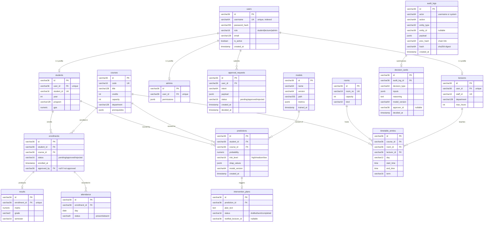

# PHASE 3 - Database Design (PostgreSQL)

## Beru Campus AI - Autonomous Multi-Agent University Operating System

| Field | Value |
|---|---|
| Project | Beru Campus AI |
| Phase | Phase 3 - Database Design (PostgreSQL) |
| Document Version | 1.0 |
| Status | Draft |
| Last Updated | 2026-08-11 |
| Prerequisites | docs/PHASE1_Requirement_Analysis.md, docs/PHASE2_System_Design.md |

**Scope:** relational schema for PostgreSQL (the single source of truth). Tables, relationships, primary/foreign keys, indexes, constraints, normalization analysis, and the **full executable SQL schema** in `deploy/schema.sql`. Neo4j (knowledge graph), Qdrant (vectors), and Redis (cache) are derived read models rebuilt from this schema (see PHASE2 11).

---

## 1. Design Goals & Principles

| # | Principle | Decision |
|---|---|---|
| D1 | Single source of truth | PostgreSQL holds every transactional row; Neo4j/Qdrant/Redis are rebuilt from it via Celery sync tasks. No distributed transactions. |
| D2 | Normalize first, denormalize deliberately | Core entities are in 3NF; JSONB is used only for flexible explainability payloads and graph-mirror convenience. Every denormalization is justified in 3. |
| D3 | Audit must be tamper-evident | `audit_logs` is append-only with a `prev_hash`/`hash` chain; triggers block `UPDATE`/`DELETE`; privileges grant `INSERT`/`SELECT` only. |
| D4 | UUIDs as canonical strings | PKs are `VARCHAR(36)` to match the existing app models and simplify Neo4j string interop. Production alternative: native `UUID` + `gen_random_uuid()` (5.4). |
| D5 | JSONB not JSON | Flexible payload columns use `JSONB` for indexing and faster reads. |
| D6 | Every high-impact write leaves a forensic trace | `enrollments.approved_by`, `approval_requests`, and `decision_cards` link the human-in-the-loop approver to each data change. |

---

## 2. Table Catalogue (16 tables)

| # | Table | Purpose |
|---|---|---|
| 1 | `users` | Authentication + role (student/lecturer/admin) |
| 2 | `students` | Student profile (1:1 with users) |
| 3 | `lecturers` | Lecturer profile (1:1 with users) |
| 4 | `admins` | Admin profile (1:1 with users) |
| 5 | `courses` | Course catalogue; prerequisites as JSONB |
| 6 | `enrollments` | Registration records with HITL status |
| 7 | `results` | Per-enrollment grades |
| 8 | `attendance` | Per-enrollment daily attendance |
| 9 | `rooms` | Physical resources |
| 10 | `timetable_entries` | Solved timetable assignments |
| 11 | `predictions` | Model risk scores + SHAP values |
| 12 | `intervention_plans` | Drafted interventions |
| 13 | `approval_requests` | Human-in-the-loop approval queue |
| 14 | `audit_logs` | Append-only, hash-chained event log |
| 15 | `decision_cards` | "Why" summary per automated decision |
| 16 | `models` | ML model registry mirror (points to MLflow) |

The scaffold also has `Role` as a string column (not a table) for RBAC simplicity. Departments and semesters are free-text columns on `students`/`courses`/`results` - kept denormalized on purpose (see 3.3).

---

## 3. Normalization Analysis

### 3.1 Forms achieved

| Form | Status | Evidence |
|---|---|---|
| 1NF | Achieved | Every column holds atomic values; multivalued data (a course's prerequisites) is stored as JSONB, which is a first-class PostgreSQL value type, or in separate rows (enrollments, attendance). |
| 2NF | Achieved | Every non-key attribute depends on the full primary key. No composite keys exist except `enrollments` which has its own surrogate PK; the (student_id, course_id) pair is a UNIQUE constraint, not the PK. |
| 3NF | Achieved | No transitive dependencies. Example: `results` derives grade from marks by application rule, but the grade is stored explicitly as a denormalized convenience; courses/students/rooms are keyed by their own surrogate PKs and never duplicated. |
| BCNF | Satisfied | All deterministic dependencies have a candidate key on the left side. `users.id` is the sole key; `students.student_id` is an alternate key. |

### 3.2 Deliberate denormalization (justified)

| Location | Denormalization | Justification |
|---|---|---|
| `courses.prerequisites` (JSONB) | Linked-course list kept inline instead of a `course_prerequisites` junction table | The app reasons about prerequisites via Neo4j (graph) for deep traversal and via this column for quick validation. A junction table would duplicate the Neo4j edge model with no query benefit at this scale. |
| `results.grade` | Stored alongside `marks` | Grades are a bounded set computed from marks; storing both avoids repeated mapping and supports indexes. |
| `students.program` / `courses.department` | Free-text department name instead of `departments.id` FK | Common lookup values are not mutated in the FYP scope; a lookup table would add a join without reducing storage. Canonicalized in Neo4j on sync. |
| `audit_logs.payload`, `decision_cards.inputs`, `predictions.shap_values`, `approval_requests.payload` (JSONB) | Arbitrary structured metadata stored inline | These payloads are event/explainability data with no fixed shape; JSONB keeps them queryable (`@>` operators) and indexable (GIN) without rigid columns. |
| `timetable_entries.term` | Term text repeated | Semester cadence is fixed in scope; kept as text, indexed, no join. |

### 3.3 What we deliberately did NOT do

- No EAV (entity-attribute-value) pattern - JSONB replaces it more cleanly.
- No full normalization of the knowledge graph into RDBMS - relationships live in Neo4j, the correct engine for arbitrary-depth traversal (PHASE2 5.2).
- No per-role user tables - single `users` table with a `role` discriminator and optional 1:1 profile rows (a clean, standard RBAC pattern for an FYP).

---

## 4. Relationships & Index Strategy

### 4.1 Relationship map (crow's-foot emphasis)

| From | To | Cardinality | Rule |
|---|---|---|---|
| users.users.id | students.user_id / lecturers.user_id / admins.user_id | 1 : 0..1 | ON DELETE CASCADE, UNIQUE (one profile per user) |
| students.id | enrollments.student_id | 1 : 0..n | ON DELETE CASCADE |
| courses.id | enrollments.course_id | 1 : 0..n | ON DELETE RESTRICT |
| enrollments.id | results.enrollment_id | 1 : 0..1 | ON DELETE CASCADE |
| enrollments.id | attendance.enrollment_id | 1 : 0..n | ON DELETE CASCADE |
| courses.id | timetable_entries.course_id | 1 : 0..n | ON DELETE CASCADE |
| rooms.id | timetable_entries.room_id | 1 : 0..n | ON DELETE RESTRICT |
| lecturers.id | timetable_entries.lecturer_id | 1 : 0..n | ON DELETE RESTRICT |
| students.id / courses.id | predictions | 1 : 0..n | ON DELETE CASCADE |
| predictions.id | intervention_plans.prediction_id | 1 : 0..1 | ON DELETE CASCADE |
| users.id | approval_requests.user_id | 1 : 0..n | ON DELETE CASCADE |
| audit_logs.id | decision_cards.audit_log_id | 1 : 0..1 | ON DELETE CASCADE |
| models.id | predictions.model_id | 1 : 0..n | ON DELETE RESTRICT |

### 4.2 Index strategy

| Table | Index | Type | Why |
|---|---|---|---|
| users | `uq_users_username` | UNIQUE B-tree | login lookup (exact match) |
| users | `ix_users_role` | B-tree | RBAC filtering |
| students | `uq_students_student_id` | UNIQUE B-tree | public identifier lookup |
| lecturers | `uq_lecturers_staff_id` | UNIQUE B-tree | staff lookup |
| courses | `uq_courses_code` | UNIQUE B-tree | catalogue code lookup |
| enrollments | `uq_enrollment_student_course` | UNIQUE (composite) | prevents duplicate registration |
| enrollments | `ix_enrollments_status` | B-tree | pending-approval queue scans |
| enrollments | `ix_enrollments_status_partial` | PARTIAL B-tree (`WHERE status='pending'`) | tiny, hot index for the approval inbox |
| results | `uq_results_enrollment` | UNIQUE B-tree | one result per enrollment |
| attendance | `ix_attendance_enrollment` | B-tree | feature engineering joins |
| attendance | `ix_attendance_enrollment_day` | B-tree (composite) | daily updates |
| timetable_entries | `ix_tt_course` / `ix_tt_room` / `ix_tt_lecturer` | B-tree | conflict checks + solve input |
| predictions | `ix_predictions_student` / `ix_predictions_course` | B-tree | per-student history, per-course risk |
| predictions | `ix_predictions_created` | B-tree DESC | latest scores query |
| audit_logs | `ix_audit_created` | B-tree DESC | chronological paging |
| audit_logs | `ix_audit_actor` / `ix_audit_action` / `ix_audit_entity` | B-tree | filter/export |
| audit_logs | `uq_audit_hash` | UNIQUE B-tree | chain integrity |
| audit_logs | `ix_audit_payload_gin` | GIN (`payload`) | search within event payloads (`@>`) |
| all JSONB | `ix_*_payload_gin` | GIN | payload `@>` queries |
| timetable_entries | `ix_tt_conflict_guard` | B-tree (room, day, start_time) | OR-Tools conflict pre-check |

---

## 5. ER Diagram



Note: `approved_by` (enrollments) and `approver_id` (decision_cards) point at `users.id` but are not declared as FKs in the scaffold DDL to avoid circular dependency headaches in SQLite; in the PostgreSQL DDL they ARE declared as FKs (see schema.sql) with `ON DELETE SET NULL`.

---

## 6. Full SQL Schema

The complete, executable PostgreSQL DDL is in **`deploy/schema.sql`**. It includes:

1. `CREATE TABLE` for all 16 tables with the EXACT columns above.
2. All PRIMARY KEY, FOREIGN KEY (with delete rules), and UNIQUE constraints.
3. All B-tree, partial, and GIN indexes from 4.2.
4. `CHECK` constraints: `role IN (...)`, `enrollments.status IN (...)`, `predictions.risk_level IN (...)`, `attendance.status IN (...)`, `grades` match `^[A-F]$`, cardinality (`capacity >= 0`, `credits BETWEEN 1 AND 6`, `marks BETWEEN 0 AND 100`).
5. An append-only TRIGGER on `audit_logs` that raises an exception on `UPDATE` or `DELETE`.
6. `COMMENT ON` docstrings per table.

Apply it:

```bash
docker compose up -d postgres
docker compose exec postgres psql -U beru -d beru -f /dev/stdin < deploy/schema.sql
```

The app's SQLAlchemy models (`backend/app/models/entities.py`) mirror this DDL. The scaffold currently uses `create_all()` for the SQLite demo; adopt `schema.sql` + Alembic for the Postgres deployment (Phase 6).

### 6.1 Mapping to SQLAlchemy models (existing)

| SQL table | SQLAlchemy model | Notes |
|---|---|---|
| users / students / lecturers / admins | `User`, `Student`, `Lecturer`, `Admin` | `role` discriminator; 1:1 profile FK |
| courses | `Course` | `prerequisites` JSONB matches model's `JSON` column (switch to `JSONB` for PG) |
| enrollments / results / attendance | `Enrollment`, `Result`, `AttendanceRecord` | unique (student, course) enforced in both |
| rooms / timetable_entries | `Room`, `TimetableEntry` | direct match |
| predictions / intervention_plans | `Prediction`, `InterventionPlan` | `shap_values` JSONB |
| approval_requests | `ApprovalRequest` | `intent` + `payload` |
| audit_logs / decision_cards | `AuditLog`, `DecisionCard` | hash chain written by `app/core/audit.py` |
| models | `ModelRecord` | MLflow artifact path |

---

## 7. Data Integrity & Security Notes

| Concern | Mechanism |
|---|---|
| Tamper evidence | `audit_logs.prev_hash -> hash` SHA-256 chaining (app-written) + DB trigger blocking UPDATE/DELETE + `UNIQUE(audit_logs.hash)`. Chain root is `GENESIS`. |
| Referential integrity | All FKs defined; `ON DELETE` rules chosen per relationship (cascade for ownership, restrict for critical refs). |
| Duplicate prevention | `UNIQUE(student_id, course_id)` on enrollments; `UNIQUE(enrollment_id)` on results; `UNIQUE(user_id)` on each profile table. |
| PII minimization | Schema stores only synthetic data; `password_hash` is bcrypt, never plaintext; no raw PII fields beyond names used in generated data. |
| RBAC enforcement | Role column + row access enforced at the API layer (FastAPI `require_role`); Postgres roles can be added later for defense-in-depth. |
| Payload search | GIN indexes on JSONB let the audit agent answer "who touched this entity type?" via `payload @> '{"entity_type":"..."}'`. |

---

## 8. Traceability to Phase 1 FRs

| FR | Schema support |
|---|---|
| FR-1 auth/RBAC | `users`, `admins`, `students`, `lecturers` |
| FR-2 academic ops | `courses`, `enrollments`, `results`, `attendance` |
| FR-3 prediction | `predictions`, `intervention_plans`, `models` |
| FR-4 resource optimization | `rooms`, `timetable_entries` |
| FR-6 synthetic data | all tables (generator writes every table) |
| FR-7 audit trail | `audit_logs`, `decision_cards`, `approval_requests` + trigger |

---

## 9. Next Steps

1. Write/commit `deploy/schema.sql` (done in repo).
2. Add Alembic migrations (Phase 6) so the Postgres deployment adopts this DDL.
3. Rebuild Neo4j sync to read from the canonical `models`/`predictions` rows.
4. Verify GIN index usage with `EXPLAIN ANALYZE` on audit payload queries.

