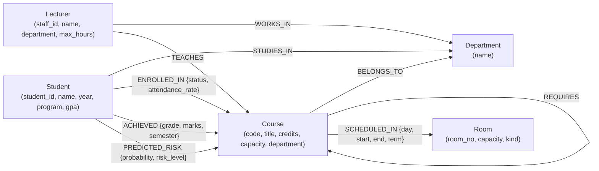
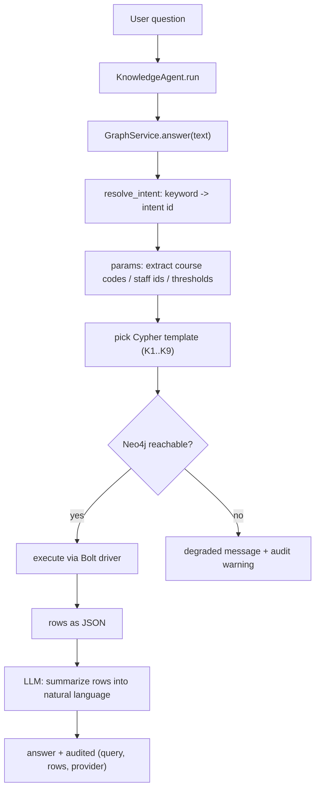

# PHASE 4 - Knowledge Graph (Neo4j)

## Beru Campus AI - Autonomous Multi-Agent University Operating System

| Field | Value |
|---|---|
| Project | Beru Campus AI |
| Phase | Phase 4 - Knowledge Graph (Neo4j) |
| Document Version | 1.0 |
| Status | Draft |
| Last Updated | 2026-08-11 |
| Prerequisites | PHASE2 (architecture), PHASE3 (relational schema) |

**Scope:** the Neo4j property-graph model: node labels, relationship types, constraints/indexes, the Cypher query catalogue, how the four agents query and use the graph, and the PostgreSQL-to-Neo4j sync strategy. Executable seed is in `deploy/neo4j/seed.cypher`.

---

## 1. Why a Graph (vs. querying Postgres only)

| Capability | Relational (Postgres) | Graph (Neo4j) |
|---|---|---|
| Multi-hop traversal ("does CS302 require MATH101 transitively?") | Recursive CTEs - verbose, depth-limited by convention | Native `*` expansion / `shortestPath` |
| Pattern matching ("lecturers whose courses have >3 high-risk students") | Many joins of variable depth | One `MATCH` pattern |
| Semantic questions ("who teaches what the at-risk students take?") | Complex derived tables | Natural graph traversal |
| Entity graph as ground truth for LLMs | Needs manual joins into JSON | Nodes/edges serialize directly to context |

Postgres stays the source of truth (PHASE3); Neo4j is a **derived, read-optimized** model. The graph gives the Knowledge Agent (A4) and its cross-domain intent queries their expressive power, and gives agents a fast entity-relationship view for reasoning and explanation.

---

## 2. Graph Schema

### 2.1 Node labels and properties

| Label | Properties | Source table (Postgres) |
|---|---|---|
| `Student` | `student_id` (UK), `name`, `year`, `program`, `gpa` | `students` |
| `Lecturer` | `staff_id` (UK), `name`, `department`, `max_hours` | `lecturers` |
| `Course` | `code` (UK), `title`, `credits`, `capacity`, `department` | `courses` |
| `Room` | `room_no` (UK), `capacity`, `kind` | `rooms` |
| `Department` | `name` (UK) | derived from `students.program` / `courses.department` / `lecturers.department` |

> Attendance, grades, risk, and scheduling are modeled as **relationship properties** (attributes of a pair), not nodes - the graph stays lean and queries stay fast. Result/attendance tables in Postgres aggregate into properties on the `ENROLLED_IN` / `ACHIEVED` edges.

### 2.2 Relationship types

| Relationship | From | To | Direction & cardinality | Properties | Meaning |
|---|---|---|---|---|---|
| `STUDIES_IN` | Student | Department | 1 : 1 | - | program affiliation |
| `WORKS_IN` | Lecturer | Department | 1 : 1 | - | department affiliation |
| `BELONGS_TO` | Course | Department | n : 1 | - | course department |
| `TEACHES` | Lecturer | Course | 1 : n | - | instruction assignment |
| `REQUIRES` | Course | Course | n : n (self) | - | prerequisite |
| `ENROLLED_IN` | Student | Course | n : n | `status`, `attendance_rate`, `enrolled_at` | registration (incl. HITL status) |
| `ACHIEVED` | Student | Course | n : n | `grade`, `marks`, `semester` | final outcome |
| `SCHEDULED_IN` | Course | Room | n : n | `day`, `start_time`, `end_time`, `term` | timetable slot |
| `PREDICTED_RISK` | Student | Course | n : n | `probability`, `risk_level`, `model_version`, `created_at` | ML prediction edge |

### 2.3 Schema diagram



---

## 3. Schema Enforcement (Constraints & Indexes)

`deploy/neo4j/seed.cypher` creates these idempotently:

```cypher
CREATE CONSTRAINT student_id IF NOT EXISTS FOR (s:Student) REQUIRE s.student_id IS UNIQUE;
CREATE CONSTRAINT course_code IF NOT EXISTS FOR (c:Course) REQUIRE c.code IS UNIQUE;
CREATE CONSTRAINT lecturer_id IF NOT EXISTS FOR (l:Lecturer) REQUIRE l.staff_id IS UNIQUE;
CREATE CONSTRAINT room_no IF NOT EXISTS FOR (r:Room) REQUIRE r.room_no IS UNIQUE;
CREATE INDEX IF NOT EXISTS FOR (s:Student) ON (s.program);
CREATE INDEX IF NOT EXISTS FOR (s:Student) ON (s.gpa);
CREATE INDEX IF NOT EXISTS FOR (l:Lecturer) ON (l.department);
CREATE INDEX IF NOT EXISTS FOR (l:Lecturer) ON (l.max_hours);
CREATE INDEX IF NOT EXISTS FOR (c:Course) ON (c.title);
CREATE INDEX IF NOT EXISTS FOR (c:Course) ON (c.department);
```

Uniqueness constraints guarantee **MERGE-based sync is idempotent**: re-running the Celery sync never duplicates nodes.

---

## 4. Cypher Query Catalogue (mapped to agent intents)

Each intent from PHASE2's `GraphService.resolve_intent()` maps to a parameterized template. Course codes / staff IDs are extracted from the user's text and injected as parameters (never string-concatenated - injection-safe).

### K1 - Overloaded lecturers (knowledge intent)
```cypher
MATCH (l:Lecturer)-[:TEACHES]->(c:Course)
RETURN l.staff_id AS lecturer, l.department AS dept, count(c) AS course_count
ORDER BY course_count DESC LIMIT $limit
```

### K2 - Repeated failures (knowledge/student-success intent)
```cypher
MATCH (s:Student)-[a:ACHIEVED]->(c:Course)
WHERE a.grade IN ['F', 'E']
WITH s, c, count(a) AS fails
WHERE fails >= $min_fails
RETURN s.student_id AS student, c.code AS course, fails
ORDER BY fails DESC
```

### K3 - Room utilization (resource intent)
```cypher
MATCH (:Course)-[sch:SCHEDULED_IN]->(r:Room)
RETURN r.room_no AS room, r.kind AS kind, count(sch) AS bookings,
       round(100.0 * count(sch) / $available_slots) AS utilization_pct
ORDER BY bookings DESC
```

### K4 - Who teaches a course (knowledge intent)
```cypher
MATCH (l:Lecturer)-[:TEACHES]->(c:Course {code: $code})
RETURN l.staff_id AS lecturer, l.name AS name
```

### K5 - Prerequisite path / eligibility (academic intent)
```cypher
MATCH path = shortestPath((a:Course {code: $from})-[:REQUIRES*]->(b:Course {code: $to}))
RETURN [n IN nodes(path) | n.code] AS prerequisite_chain, length(path) AS hops
```

### K6 - High-risk students per lecturer (student-success intent)
```cypher
MATCH (l:Lecturer)-[:TEACHES]->(c:Course)<-[p:PREDICTED_RISK]-(s:Student)
WHERE p.risk_level = 'high'
RETURN l.staff_id AS lecturer, c.code AS course, collect(DISTINCT s.student_id) AS at_risk_students,
       round(avg(p.probability), 3) AS avg_risk
```

### K7 - Low-attendance flagged registrations (academic/success intent)
```cypher
MATCH (s:Student)-[e:ENROLLED_IN {status: 'approved'}]->(c:Course)
WHERE e.attendance_rate < $threshold
RETURN s.student_id AS student, c.code AS course, round(e.attendance_rate, 3) AS attendance_rate
ORDER BY e.attendance_rate ASC LIMIT $limit
```

### K8 - Same-lecturer cohort (explanation / intervention context)
```cypher
MATCH (c1:Course)<-[:TEACHES]-(l:Lecturer)-[:TEACHES]->(c2:Course),
      (s:Student)-[:ENROLLED_IN]->(c1),
      (s:Student)-[:ENROLLED_IN]->(c2)
WHERE c1 <> c2
RETURN s.student_id AS student, l.staff_id AS lecturer, collect(DISTINCT c1.code + '/' + c2.code) AS course_pairs
LIMIT $limit
```

### K9 - Entity lookup for RAG enrichment (academic intent)
```cypher
MATCH (c:Course {code: $code})<-[:ENROLLED_IN]-(s:Student)
RETURN c.code AS code, c.title AS title, c.credits AS credits,
       count(DISTINCT s) AS enrolled_count, c.capacity AS capacity
```

---

## 5. How Agents Query and Use Neo4j

### 5.1 Shared service - `GraphService` (backend/app/services/graph_service.py)

All agents go through one service that: (1) resolves the user text to an intent, (2) looks up the Cypher template (with parameter extraction), (3) runs it via the Neo4j Bolt driver, (4) returns rows as JSON, and (5) emits an audit event (intent + query + row count). If Neo4j is down it falls back to a degraded, clearly-labelled response - the "graceful degradation" NFR.



> Route: the **Supervisor** (PHASE2 3) routes "graph-like" questions (lecturer workloads, department queries, who-teaches, overloaded, repeated failures, utilization) to the **Knowledge Agent**; other agents call `GraphService` directly as a tool for their own validation (prereq checks, risk context, room conflicts).

### 5.2 Per-agent usage

| Agent | Graph usage | Query IDs |
|---|---|---|
| **Knowledge Agent (A4)** | NL-to-intent mapping, cross-domain answers, rows summarized by LLM | K1, K2, K3, K4, K8 |
| **Academic Ops (A1)** | Prerequisite eligibility via `REQUIRES*` path; catalog enrichment | K5, K9 |
| **Student Success (A2)** | Risk clusters per lecturer; same-lecturer cohorts for intervention context | K6, K8 |
| **Resource Optimizer (A3)** | Room utilization + conflict pre-check | K3 |

### 5.3 Natural-language-to-Cypher approach (FYP scope)

Phase 4 ships **deterministic intent mapping** (keyword rules + parameter extraction) - every query in section 4 is fixed, parameterized, and auditable. This is deliberate: rule-based Cypher is deterministic, testable, and safe for an FYP, and the audit trail can prove exactly what was executed.

Future (documented, not built): inject the schema (labels/relations/constraints) into the LLM prompt, let it propose Cypher, then **validate the generated query** against a whitelist of read-only signature patterns before execution.

---

## 6. PostgreSQL -> Neo4j Sync (consistency)

The graph is rebuilt from Postgres by idempotent **`MERGE`** tasks (Celery), triggered after generation and on demand.

```cypher
// pattern per node type (simplified):
MERGE (st:Student {student_id: $student_id})
  ON CREATE SET st.name = $name, st.year = $year, st.program = $program
  ON MATCH  SET st.name = $name, st.year = $year, st.program = $program, st.gpa = $gpa;
```

Sync guarantees:
| Concern | Approach |
|---|---|
| Idempotency | `MERGE` on unique property + uniqueness constraints (section 3) |
| Ordering | Create nodes first, then relationships (avoid dangling refs) |
| Deletions | Full-resync mode: `MATCH (n) DETACH DELETE n` then rebuild (safe for demo scale) |
| Aggregates | `attendance_rate`, risk edges recomputed from `attendance` / `predictions` tables |
| Trust | Postgres remains authoritative; Neo4j is rebuilt, never written by agents directly |

The current scaffold implements the first pass of this sync in `graph_service.sync_graph_from_db()` (students/courses/lecturers); the full relationship set in section 2.2 is the Phase 4 target implemented by the Celery `sync_graph` task.

---

## 7. Traceability

| Phase 1 FR / PHASE2 element | Neo4j support |
|---|---|
| FR-5.1 entities + relationships | Section 2 node/edge model |
| FR-5.2 NL cross-domain queries | Section 4 K1-K4, K6, K8 |
| FR-5.3 RAG | Section 5.3 enrichment (K9) |
| NFR graceful degradation | Section 5.1 Neo4j-down fallback |
| NFR auditability | every query audited with row count |

---

## 8. Next Steps

1. Commit `deploy/neo4j/seed.cypher` (constraints + sample graph).
2. Extend `sync_graph_from_db()` in the scaffold to the full section-2 schema + add Celery task.
3. Wire Knowledge Agent intents to the K1-K9 catalogue (backend/app/services/graph_service.py `_INTENT_CYPHER`).
4. Add tests that run against a live Neo4j container in CI (extend compose profile).
