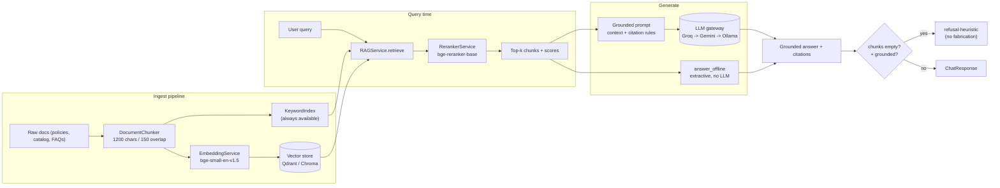

# PHASE 6 — RAG System

> Status: **IMPLEMENTED** (offline-first core) — document pipeline, chunking, hybrid
> keyword+embedding retrieval, reranking, grounding/citation, and retrieval-only
> answers without generation are built and tested. Residual work marked 🔜.

- **Embedding:** `BAAI/bge-small-en-v1.5` via `sentence-transformers` (MiniLM-class; `EMBEDDING_MODEL` can point to any `sentence-transformers` name, e.g. `all-MiniLM-L6-v2`).
- **Reranker:** `bge-reranker-base` (`CrossEncoder`).
- **Vector DB:** Qdrant (default) with automatic ChromaDB fallback.
- **Offline-first:** a pure-Python `KeywordIndex` makes keyword retrieval available with **zero external services**; an extractive answer path never calls an LLM.
- **Code:** `backend/app/services/pipeline.py`, `backend/app/services/rag.py`, `backend/app/services/vector_store.py`, `backend/app/services/llm.py`.

---

## 1. Architecture



---

## 2. Document pipeline (`app/services/pipeline.py`)

### 2.1 Ingestion (`ingest_documents(docs)`)
`docs` are document records `{id?, source, title, text}`. The pipeline:

1. **Chunks** each document with `DocumentChunker`.
2. **Embeds + upserts** each chunk into the vector store (`rag.store.upsert(chunk_id, embedding, payload)`) — only when a vector store is available (best-effort, exceptions do not block ingestion).
3. **Indexes keywords** into the in-memory `KeywordIndex` — **always**, even with no vector DB/embedding model.

Returns stats `{docs_seen, chunks, vector_upserts}` (audited via `record_event` when exposed through an endpoint, 🔜).

### 2.2 Chunking (`DocumentChunker`)
- Config: `CHUNK_SIZE_CHARS` (default **1200**), `CHUNK_OVERLAP_CHARS` (default **150**).
- **Sentence-streaming** splitter — chunks grow sentence by sentence (natural semantic units) up to the cap, then emit; the **tail within the overlap window** carries into the next chunk so context on boundaries is preserved.
- Every chunk carries stable metadata: `chunk_id` (unique `doc_id#<i>`), `doc_id` (logical document), `source`, `title`, `chunk_idx`, `content`.

---

## 3. Embeddings (`app/services/vector_store.py`)

| Component | Behavior |
|-----------|----------|
| `EmbeddingService` | `SentenceTransformer(EMBEDDING_MODEL)`; default **`BAAI/bge-small-en-v1.5`** (384-d). Swap to MiniLM by setting `EMBEDDING_MODEL=all-MiniLM-L6-v2`. |
| Hash fallback | If `sentence-transformers` is missing: **deterministic 384-d hashed bag-of-tokens** embedding. Same tokenization as `KeywordIndex` ⇒ retrieval stays vocabulary-consistent offline. |
| `RerankerService` | `CrossEncoder(bge-reranker-base)`; if unavailable, falls back to candidate order (degraded but functional). |

---

## 4. Vector database (Qdrant / Chroma)

`get_vector_store()` resolves the backend with a **preference + fallback chain**:

```
VECTOR_STORE_BACKEND (default qdrant)  ->  the other one  ->  None (retrieval disabled)
```

- **QdrantStore** — collection `beru_documents`, `VectorParams(size=384, distance=COSINE)`; supports both `query_points` and legacy `search`.
- **ChromaStore** — same `beru_documents` collection via `chromadb`.
- Selection is pinned as a module singleton; failures are logged and degrade gracefully.

🔜 In addition to Qdrant+Chroma, run both behind one protocol (`VectorStore.search/upsert`) — already the case via the `VectorStore` Protocol.

---

## 5. Retrieval & reranking (`RAGService.retrieve`)

**Hybrid two-channel retrieval merged into one ranked list:**

1. **Embedding channel (when store is up):** embed query → `store.search(embedding, RAG_CANDIDATES=20)`.
2. **Keyword channel (always):** `self.keyword.search(query, 20)` — length-normalized term-frequency overlap.
3. **Merge + dedupe** (by `content`/`doc_id`).
4. **Rerank** with `bge-reranker-base` → keep `RAG_TOP_K=4`.

This means retrieval quality improves as infrastructure is added but **never goes fully dark**: with no Qdrant, no Chroma, and no embedding model, the keyword channel still returns relevant chunks.

---

## 6. Prompt engineering, grounding, citation, hallucination prevention (`RAGService.answer`)

### 6.1 Grounded prompt
When chunks are retrieved, the user turn is built as:

```
You are Beru Campus AI. Answer using ONLY the provided context.
Cite sources as [0], [1], ... where each bracket number maps to the context
list above. If the context does not contain the answer, say you don't know.
Do not invent facts, figures, or procedures.
```
with
```
CONTEXT:
[0] <chunk content>
[1] <chunk content>
...

QUESTION: <query>
```

### 6.2 Citations
- Each chunk maps to a bracket `[i]`; `_cite(i, chunk)` renders `[i] Title (source)`.
- `ChatResponse.citations` and the agent audit event carry the citation list, so every claim is traceable to a document.

### 6.3 Grounding guard (no generation on empty context)
- Default `answer(query, require_grounded=True)`.
- If **no chunk was retrieved**, the LLM is **never invoked** — the service returns a refusal (`provider='grounding-guard'`, `model='refusal-heuristic'`):
  > "I can't answer that confidently from the Beru knowledge base."
- This is the primary anti-hallucination control: no context ⇒ no ungrounded free-generation.
- `require_grounded=False` (opt-in flag) allows ungrounded chat-style answers for non-factual queries.

### 6.4 Degraded-LLM handling
If the LLM gateway falls back to its rule-based responder while evidence exists, generation is abandoned in favour of the **extractive** answer (§7) rather than responding with an unhelpful fallback stub.

---

## 7. Offline-first fallback — retrieval without generation (`RAGService.answer_offline`)

The explicit guarantee required by Phase 6: **keyword + embedding retrieval WITHOUT generation**:

- Uses the same `retrieve()` hybrid pipeline.
- Selects, for the top chunks, the **highest query-token-overlap sentence** (`_best_sentence`) and stitches them into an extractive answer:
  > From the Beru knowledge base:
  > - <best sentence citing its chunk>
- Returns `provider='offline-extractive'`, `model='extractive'`, with citations.
- **Zero LLM calls** — works with all clouds down, no Ollama, no API keys.

Degradation ladder (best → worst, all safe):

| State | Behaviour |
|-------|-----------|
| LLM + vector store + bge | grounded generative answer, citations |
| LLM up, no/store empty | grounding-guard refusal (no fabrication) |
| No LLM, retrieval has hits | `answer_offline` extractive answer with citations |
| No LLM + no hits | refusal / "no matching documents" |

---

## 8. Settings (`app/config.py`)

| Setting | Default | Purpose |
|---------|---------|---------|
| `EMBEDDING_MODEL` | `BAAI/bge-small-en-v1.5` | embedding model (swap MiniLM) |
| `RERANKER_MODEL` | `bge-reranker-base` | cross-encoder reranker |
| `RAG_TOP_K` | 4 | chunks used for context |
| `RAG_CANDIDATES` | 20 | candidates pre-rerank |
| `CHUNK_SIZE_CHARS` | 1200 | chunk cap |
| `CHUNK_OVERLAP_CHARS` | 150 | chunk boundary overlap |
| `VECTOR_STORE_BACKEND` | `qdrant` | preferred vector backend |

---

## 9. Verified behaviour (`tests/test_rag.py`, 5 tests — all green)

| Test | Proves |
|------|--------|
| `test_chunker_chunks_and_overlaps` | multiple chunks, unique ids, metadata, overlap carry-over |
| `test_keyword_index_ranks_relevant_first` | keyword retrieval orders relevant doc first; no false hits |
| `test_ingest_and_offline_extractive_answer` | ingest → chunk → keyword index (0 vector upserts offline); `answer_offline` yields excerpt + citation, `provider='offline-extractive'` |
| `test_grounded_guard_refuses_empty_context` | **LLM never called** on empty context; refusal returned |
| `test_answer_grounds_on_context_with_citations` | LLM called with `CONTEXT:` block; answer + `[0]` citation produced |

Full suite: **9 passed** (5 new + 4 existing).

---

## 10. Implementation order (remaining 🔜)

1. **Ingest endpoint** — `POST /api/v1/rag/ingest` (admin) calling `ingest_documents` in a `BackgroundTasks` task + audit event; export pipeline stats to `/metrics`.
2. **Knowledge-base seeding job** — on startup or Celery beat: load catalog/FAQ docs (from the synthetic generator and static policy files) through the pipeline; idempotent (re-run rebuilds by `doc_id`).
3. **Persist keyword index / BM25** — optional: replace in-memory `KeywordIndex` with a disk-backed (sqlite FTS5 / Tantivy) index for cross-restart persistence at larger KB scale.
4. **Evaluation harness** — `tests/test_rag.py` fixtures with a small gold set; add retrieval quality metrics (recall@k, MRR) and a generation faithfulness check (claim-level overlap vs. context).
5. **Chunk/pipeline tuning** — expose `chunk_size/overlap` and `top_k/candidates` per-dataset config; document recommended values for catalog vs. policy corpora.
6. **Hybrid score fusion** — when the reranker is unavailable, blend vector & keyword scores (max/reciprocal-rank) instead of channel order.
7. **Query rewriting** — lightweight expansion/contraction for short queries before retrieval.

---

## 11. FR traceability

| Requirement | Delivered by |
|-------------|--------------|
| RAG over campus knowledge | `RAGService.answer` grounded generation |
| Accurate, source-grounded answers | top-k retrieval + grounding guard + citations |
| Privacy-friendly local option | Ollama in gateway chain; local embedding/reranker; offline path |
| Works offline / degraded | keyword-only retrieval, extractive `answer_offline`, hash embeddings |
| No hallucinated content | empty-context refusal; "don't know" instruction; degraded-LLM → extractive |
