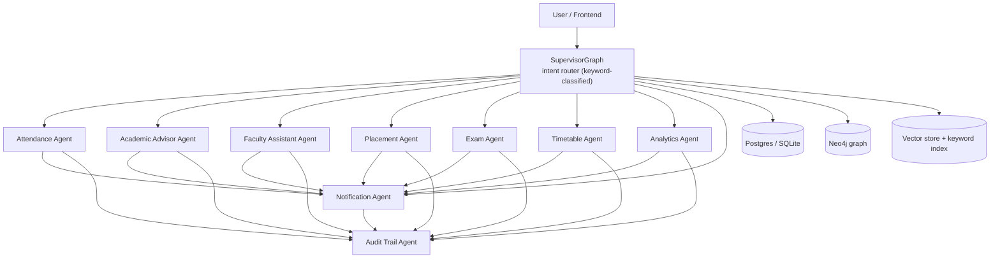
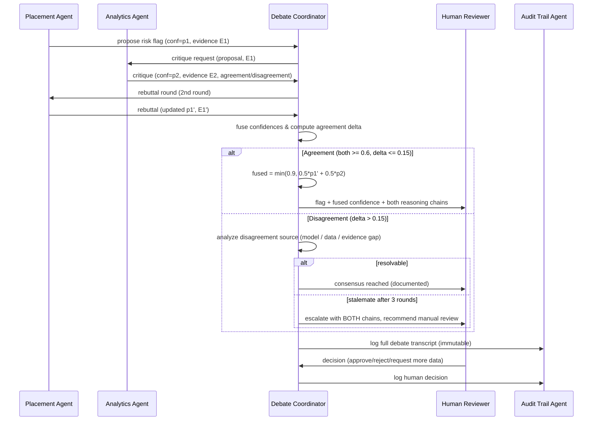

# PHASE 7 — AI Agent Design (9 Agents + Multi-Agent Debate)

> Status: **DESIGN COMPLETE** — this document is the authoritative spec for the agent layer.
> Mapping to existing code: the supervisor (`app/agents/supervisor.py`) already implements the
> router + 4 specialist agents + audit/HITL terminal; the other 5 agents are specified here
> and marked 🔜 for implementation in the order of §4.
> All 9 agents run as LangGraph nodes on the shared `AgentState` machine, share the
> `core/audit` instrumentation, and report through the `ChatResponse` contract.

---

## 1. Agent family overview

---

## 2. Shared agent framework

Every agent inherits the following contracts (documented once, referenced per agent):

- **Runtime:** LangGraph node; signature `run(state: AgentState) -> AgentState`; writes `answer`, `data`, `citations`, `requires_approval`, `audit_events`.
- **Confidence scoring (composite, 0–1):** `confidence = base_determinism × evidence_coverage × agreement_factor` per agent. Tiers: `>= 0.8` act, `0.5–0.8` human review, `< 0.5` refuse + ask for clarification. Reported in `data.confidence` and persisted to the decision card.
- **Human approval gate:** declarative flag on the node; supervisor's `terminal_node` creates the `ApprovalRequest` row and the API endpoint `POST /approvals/{id}` executes/rejects (already implemented for `register`).
- **Retry strategy:** three layers — (1) DB: 3 retries, exponential backoff; (2) LLM: handled by the gateway fallback chain (Groq→Gemini→Ollama→rule/extractive); (3) solver/batch: dedicated retry with constraint relaxation or Celery retry for background jobs.
- **Memory:** short-term = `AgentState` (session); long-term = Postgres history + `DecisionCard` reasoning + vector summaries (🔜).
- **Audit:** every node appends `audit_events`; the terminal node writes `AuditLog` + `DecisionCard` (hash-linked, immutable).

| Tier | Range | Behaviour |
|------|-------|-----------|
| Green | ≥ 0.80 | auto-execute (if low-stakes) or auto-answer |
| Amber | 0.50–0.80 | human review / include caveats in answer |
| Red | < 0.50 | refuse, ask clarifying question, log refusal |

---

## 3. The 9 agents

### 3.1 Attendance Agent

| Attribute | Design |
|-----------|--------|
| **Goal** | Track attendance, flag low-attendance students early, and trigger intervention notifications. |
| **Responsibilities** | Ingest attendance events; compute per-course attendance rates; flag students below threshold (default 60% per term); suggest intervention via Notification Agent; answer attendance queries with evidence. |
| **Inputs** | Attendance events (`student_id, course, date, status`), approved enrollments, threshold config. |
| **Outputs** | Attendance report, low-attendance flag list, notification triggers, answer text with citations. |
| **Prompt** | "You are the Beru Attendance Agent. Use ONLY verified attendance records. State the threshold used. If a student's record is incomplete, say so and do not estimate." |
| **Memory** | Short: session state. Long: attendance history in Postgres (current term + prior terms for trend). |
| **Tools** | `DB` attendance/enrollment queries, rule engine (threshold), `NotificationAgent.notify()`. |
| **Knowledge sources** | `attendance`, `enrollments` tables; threshold settings. |
| **Workflow** | Load records → compute rate per (student, course) → compare threshold → flag → notify (gated) → audit. |
| **Failure handling** | Missing/partial records → rate marked `insufficient_data`, never flagged on guesswork. |
| **Retry strategy** | DB ×3 exponential; deterministic path → no LLM retry needed. |
| **Human approval gate** | None for single-student flags. **Bulk notification (>50 recipients) requires admin approval.** |
| **Confidence** | 1.0 complete records; 0.6 partial; <0.5 → `insufficient_data`, no flag. |

### 3.2 Academic Advisor Agent

| Attribute | Design |
|-----------|--------|
| **Goal** | Give each student a personalized, prerequisite-safe course plan and honest progress guidance. |
| **Responsibilities** | Recommend courses by program/year; verify prerequisites and capacity; detect program blockers; explain reasoning with citations; draft a semester plan. |
| **Inputs** | Student profile, transcript (`ACHIEVED`), enrollments, course catalog, prerequisites. |
| **Outputs** | Course plan with rationale, warnings, alternatives, citation list. |
| **Prompt** | "You are Beru's Academic Advisor. Recommend only courses from the catalog. Verify prerequisites before recommending. If the transcript is missing, state it and recommend from the catalog with a warning." |
| **Memory** | Short: session. Long: per-student advising history (Postgres), transcript, program requirements. |
| **Tools** | DB catalog/transcript queries; `GraphService` prerequisite paths (K5); RAG for catalog FAQs. |
| **Knowledge sources** | `courses`, `students`, `achieved` (via `ACHIEVED`/`PREDICTED_RISK`), Neo4j prereq graph. |
| **Workflow** | Load student → build candidate plan → validate prereqs + capacity → rank by fit → present with citations → (if student asks to register) hand to HITL gate. |
| **Failure handling** | No transcript → catalog-only plan + warning; course missing → never invent it. |
| **Retry strategy** | Read-only → single attempt + cache; LLM via gateway chain. |
| **Human approval gate** | Advice: none. **Enrollment actions: admin approval (existing supervisor HITL).** |
| **Confidence** | 0.95 full transcript; 0.90 catalog-only; 0.60 conflicting prereq data → present both options. |

### 3.3 Faculty Assistant Agent

| Attribute | Design |
|-----------|--------|
| **Goal** | Give lecturers/faculty transparent answers about workloads, teaching loads, and schedules. |
| **Responsibilities** | Answer "who teaches X", "lecturer Y's load", "overloaded lecturer" queries; compute load vs `max_hours`; flag overload; summarize schedules. |
| **Inputs** | Query text, lecturer data, `TEACHES`/`SCHEDULED_IN` graph edges. |
| **Outputs** | Factual answers with row citations, workload summary, overload flags. |
| **Prompt** | "You are the Faculty Assistant. Answer only from the returned rows. Show the row counts. Never guess a lecturer's assignment." |
| **Memory** | Short: session. Long: none required (query-time). |
| **Tools** | `GraphService` (K1 overload, K4 who-teaches, K9 cohorts), Postgres fallback mirror. |
| **Knowledge sources** | Neo4j graph (primary), Postgres `lecturers/courses` (fallback). |
| **Workflow** | Classify intent → try graph → rows → summarize → cite → fallback on failure. |
| **Failure handling** | Neo4j down → Postgres mirror; both down → explain, no fabrication. |
| **Retry strategy** | Graph connect ×2, then fallback channel; LLM via gateway chain. |
| **Human approval gate** | None (read-only). |
| **Confidence** | 0.90 complete graph rows; 0.70 partial; 0.30 no data → state uncertainty explicitly. |

### 3.4 Placement Agent

| Attribute | Design |
|-----------|--------|
| **Goal** | Assess placement readiness and match students to verified openings, always under human review. |
| **Responsibilities** | Compute readiness score (GPA, skills, attendance, prior results); match against ingested job postings; draft application packages; trigger career-office notifications. |
| **Inputs** | Student profile, transcript, job postings (RAG docs), placement history. |
| **Outputs** | Readiness score with drivers, ranked matches with citations, draft cover letter. |
| **Prompt** | "You are Beru's Placement Agent. Match ONLY against the provided openings. Never invent a vacancy. Flag any student data gaps before scoring." |
| **Memory** | Short: session. Long: per-student placement history, company records. |
| **Tools** | RAG retrieval (postings), `AnalyticsAgent` risk cross-check (debate, §5), Notification Agent. |
| **Knowledge sources** | Postgres placements, vector/keyword index of verified postings. |
| **Workflow** | Load student → score readiness → retrieve openings → rank matches → cross-validate high-risk candidates (§5) → draft package → request approval before any external send. |
| **Failure handling** | No postings ingested → "no verified openings yet" + offer to upload; never guesses. |
| **Retry strategy** | LLM gateway chain; retrieval always available (keyword channel). |
| **Human approval gate** | **YES — every external submission (application forwarding, employer contact) requires placement-office approval.** Internal drafts need none. |
| **Confidence** | readiness = model score; auto-draft only at ≥ 0.75; below → ask student to complete profile. |

### 3.5 Exam Agent

| Attribute | Design |
|-----------|--------|
| **Goal** | Conflict-free exam scheduling, transparent results handling, and accurate transcripts. |
| **Responsibilities** | Schedule exams into available slots (no student/room conflicts); publish timetables; resolve results queries; produce transcripts. |
| **Inputs** | Exam entries, rooms, invigilators, prior results. |
| **Outputs** | Exam timetable, conflict report, result summaries, transcript documents. |
| **Prompt** | "You are the Exam Agent. Accuracy first: never guess grades or dates. Report any constraint you could not satisfy." |
| **Memory** | Short: session. Long: term exams, historical results (Postgres). |
| **Tools** | OR-Tools scheduling (reuse `ml/optimize.solve_timetable`), DB queries, Notification Agent. |
| **Knowledge sources** | `courses`, `rooms`, `exams`, `achieved` results. |
| **Workflow** | Load constraints → solve → verify conflict-free → report → (publish path) approval gate → notify. |
| **Failure handling** | Unsolvable → relax constraints (e.g., allow evening slots) + clearly report the relaxation. |
| **Retry strategy** | Solver ×2 with relaxation between attempts; LLM gateway chain for prose. |
| **Human approval gate** | **Timetable publication and any grade modification require admin approval.** |
| **Confidence** | 0.90 solver-feasible; 0.50 relaxed-solution → escalate; 0.30 infeasible → escalate to admin. |

### 3.6 Timetable Agent

| Attribute | Design |
|-----------|--------|
| **Goal** | Produce and maintain conflict-free, utilization-aware timetables. |
| **Responsibilities** | Build/optimize weekly timetables; detect scheduling conflicts; report room utilization (K3); answer schedule queries. |
| **Inputs** | Courses, rooms, lecturer constraints, `SCHEDULED_IN` data. |
| **Outputs** | Timetable, conflict report, utilization stats, answers with citations. |
| **Prompt** | "You are the Timetable Agent. Report the solver status honestly: optimal, feasible-with-relaxations, or heuristic. Never present a conflicting schedule as final." |
| **Memory** | Short: session. Long: term history (Postgres), prior schedules. |
| **Tools** | `ml/optimize.solve_timetable`, `GraphService` K3 room utilization, DB. |
| **Knowledge sources** | `courses`, `rooms`, scheduling edges, lecturer `max_hours`. |
| **Workflow** | Load constraints → solve → verify → report → (publish path) gate → notify affected users. |
| **Failure handling** | Solver exception → heuristic fallback with explicit label in output + audit. |
| **Retry strategy** | Solver with timeout ×2; heuristic as last resort. |
| **Human approval gate** | **Publishing a new timetable (affects all users) requires admin approval.** |
| **Confidence** | 0.95 optimal; 0.80 feasible; 0.60 heuristic → publish gate mandatory. |

### 3.7 Analytics Agent

| Attribute | Design |
|-----------|--------|
| **Goal** | Produce explainable cross-domain analytics and risk intelligence for decision-makers. |
| **Responsibilities** | Compute KPIs (enrollment, pass rates, utilization); run risk prediction (`predict_risk`); explain drivers (SHAP/feature weights); track trends; answer analytical queries. |
| **Inputs** | Query intent, full DB, prediction artifacts, model metadata. |
| **Outputs** | Metric tables, risk lists with explanations, trend notes. |
| **Prompt** | "You are Beru's Analytics Agent. Interpret only the computed metrics. Never invent numbers. State the model version and data window for every figure." |
| **Memory** | Short: session. Long: prediction history, model versions (`Prediction` rows). |
| **Tools** | DB analytics queries, `ml/predict`, `ml/features`, GraphService aggregates, Celery for batches. |
| **Knowledge sources** | All operational tables + Neo4j aggregates + `Prediction` artifacts. |
| **Workflow** | Map intent → query → compute → explain → (risk) cross-validate via debate §5 → report. |
| **Failure handling** | Model artifact missing → heuristic fallback labelled `heuristic`; no silent substitution. |
| **Retry strategy** | Batch via Celery with retry/backoff; online via gateway chain. |
| **Human approval gate** | Read-only reporting: none. **Distributing risk lists directly to students requires review.** |
| **Confidence** | model probability × data coverage; <0.40 → refuse firm claims, suggest data collection. |

### 3.8 Notification Agent

| Attribute | Design |
|-----------|--------|
| **Goal** | Deliver the right message to the right audience, reliably and non-disruptively. |
| **Responsibilities** | Queue messages; apply templates + personalization; respect channel preferences and quiet hours; dedupe; deliver via email/push/in-app (🔜 adapters); produce delivery receipts. |
| **Inputs** | Notification request (`channel`, `audience`, `template`, `payload`, `priority`). |
| **Outputs** | Queued/sent status, delivery receipts, dead-letter alerts. |
| **Prompt** | **None — deterministic pipeline by design (templated content, no LLM).** |
| **Memory** | Delivery log, preferences, quiet-hours calendar. |
| **Tools** | DB queues, SMTP/webhook adapters (🔜), template engine. |
| **Knowledge sources** | `notifications` log, user preferences. |
| **Workflow** | Validate request → dedupe → queue → fan out → record receipt → (failure) retry/backoff → dead-letter. |
| **Failure handling** | Channel down → keep queued + exponential backoff; **never blocks the calling agent**. |
| **Retry strategy** | Exponential backoff ×5, then dead-letter + admin alert. |
| **Human approval gate** | **Bulk sends (>50 recipients) require approval; sensitive categories (risk flags, disciplinary) always gated.** |
| **Confidence** | 1.0 deterministic attempt; 0.90 delivery receipt; 0.60 sent-but-unacknowledged. |

### 3.9 Audit Trail Agent

| Attribute | Design |
|-----------|--------|
| **Goal** | Record every agent decision, reasoning chain, and side effect — immutably and verifiably. |
| **Responsibilities** | Capture decision inputs, reasoning, confidence, actions, actor, timestamps; hash-link entries (append-only); serve queries/exports; expose verification. |
| **Inputs** | `AgentState` (intent, answer/reasoning, data, confidence, events), actor identity. |
| **Outputs** | Append-only `AuditLog` + `DecisionCard` rows, CSV export, hash chain integrity report. |
| **Prompt** | **None — deterministic writer by construction.** |
| **Memory** | Append-only store (hash-chained; `created_at` + `hash` over payload). |
| **Tools** | `core/audit.record_event`, `create_decision_card`, export endpoint (CSV), decision-card endpoint. |
| **Knowledge sources** | The events it is asked to record — nothing external. |
| **Workflow** | terminal_node → hash payload → insert → refresh decision card → (exports) serve queries. |
| **Failure handling** | DB write failure → buffered in-memory + retry; on persistent failure, the *originating agent's* output is marked `unrecorded`. Never silently drops. |
| **Retry strategy** | Write ×3 exponential; then surface to operator (Sentry/log). |
| **Human approval gate** | N/A — it *is* the gate recorder. **Deletion/update of entries is denied by design.** |
| **Confidence** | 1.0 by construction on successful write; hash verified on read (0.99 + verification). |

---

## 4. Routing map & implementation order

| Agent | Trigger keywords (supervisor `_classify`) | Current status |
|-------|-------------------------------------------|----------------|
| Academic Advisor | default fallback + "advise, plan, prerequisites, register" | **Partially** — `AcademicOpsAgent` (validate/register/report) |
| Analytics | "risk, predict, dropout, success, analytics, trend" | **Partially** — `StudentSuccessAgent` (predict_risk) |
| Timetable | "timetable, schedule, conflict, room, utilization" | **Partially** — `ResourceOptimizerAgent` (solve_timetable) |
| Faculty Assistant | "graph, cypher, lecturer, who teaches, overloaded" | **Partially** — `KnowledgeAgent` (GraphService) |
| Attendance | "attendance, absent, absenteeism" | 🔜 new node |
| Placement | "placement, internship, job, career" | 🔜 new node |
| Exam | "exam, result, transcript, grade" | 🔜 new node |
| Notification | (internal tool, not user-routed) | 🔜 service + adapters |
| Audit Trail | (system layer, all agents) | **Implemented** — supervisor terminal + `core/audit` |

**Implementation order:** 1) extend `_classify` + add Attendance node; 2) Notification service (unblocks agents 1/4/5/6); 3) Placement node; 4) Exam node; 5) debate protocol (§5); 6) route Analytics & Timetable behind debate where high-stakes; 7) evaluation (confidence calibration tests).

---

## 5. Multi-Agent Debate pattern (high-stakes cross-validation)

**Use case:** *Placement Agent* proposes a high dropout-risk flag for a student based on its readiness model; *Analytics Agent* cross-validates using independent features (predict_risk + SHAP) before the flag reaches a human reviewer.

### 5.1 Protocol (max 3 rounds)

### 5.2 Coordinator rules
- **Round budget:** 3 rounds max (proposal → critique → rebuttal); hard stop to bound cost.
- **Confidence fusion:** `fused = min(0.90, 0.5·p₁ + 0.5·p₂)`. Agreement delta `|p₁ − p₂|`.
- **Agreement path** (both ≥ 0.60 and delta ≤ 0.15): flag proceeds to human review with fused confidence and both reasoning chains attached.
- **Disagreement path:** coordinator classifies the source — *model mismatch* (e.g., readiness model vs risk model use different features) → both explain in plain language; *evidence gap* (one agent lacks data) → request the missing data; if unresolvable in-budget → **stalemate escalation**: both full chains forwarded to the human reviewer with an explicit "experts disagree" banner.
- **Nothing is executed automatically on high-stakes paths** — the human approval gate (§3.4) is mandatory regardless of fused confidence.
- **Cost guard:** each round = ≤2 LLM calls (gateway chain), timeout-bounded; debate transcript is capped and truncated for long chains.
- **Immutability:** every round's messages, confidences, and the final human decision are written by the **Audit Trail Agent** — the flag's full life cycle is reconstructable.

### 5.3 Where the debate applies
| Decision | Proposer | Validator | Outcome path |
|----------|----------|-----------|--------------|
| Dropout-risk flag (placement readiness) | Placement Agent | Analytics Agent | Human review w/ fused confidence |
| Risk list distribution to students | Analytics Agent | Attendance Agent (data sanity) | Admin approval (bulk) |
| Exam timetable publication | Exam Agent | Timetable Agent (conflict re-check) | Admin approval |
| Intervention assignment (tutoring) | Attendance Agent | Academic Advisor Agent | Advisor sign-off |

---

## 6. FR traceability

| Requirement | Delivered by |
|-------------|--------------|
| Intelligent campus assistant | 9-agent supervisor router |
| Evidence-based answers | citations + knowledge sources per agent |
| Safe autonomous actions | per-agent human approval gates + confidence tiers |
| Transparency & accountability | Audit Trail Agent (immutable reasoning chains) |
| High-stakes reliability | Multi-Agent Debate + stalemate escalation |
| Degraded-operation resilience | retry strategies + failure handling per agent |
