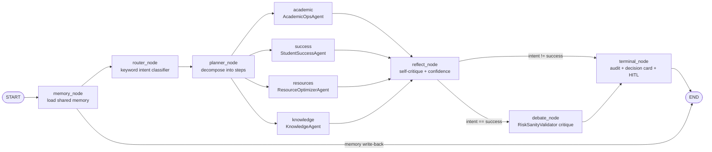

# PHASE 8 — LangGraph Orchestration

> Status: **IMPLEMENTED** — the supervisor is now a full orchestration graph with shared
> memory, planning, reflection/self-critique, and agent-to-agent debate routing.
> Code: `backend/app/agents/` (`supervisor.py`, `memory.py`, `debate.py`, `state.py`).
> Suite: **15 passed** (9 prior + 6 orchestration tests).

---

## 1. The workflow graph

Every node is a plain function `(state) -> state`; edges are declarative — LangGraph
compiles the `StateGraph` once and executes it deterministically per request.

---

## 2. State (`app/agents/state.py`)

`AgentState` is a `TypedDict` (total=False) shared by all nodes:

| Key | Written by | Consumed by | Purpose |
|-----|-----------|-------------|---------|
| `messages` | `invoke()` | router/planner | current user turn |
| `memory` | memory_node | specialists (future) | recent turns for the actor |
| `intent` | router_node | planner → conditional edges | routing key |
| `plan` | planner_node | audit/debug | ordered execution steps |
| `agent` | specialist | terminal | which agent answered |
| `answer`, `citations`, `data` | specialist | reflect, terminal, API | output payload |
| `reflection` | reflect_node | terminal (decision card) | self-critique findings |
| `confidence` | reflect → fused by debate | terminal (decision card) | 0–1 score |
| `requires_approval`, `approval_id` | specialist / debate | terminal (HITL) | approval gate |
| `debate` | debate_node | terminal (decision card) | validation transcript |
| `audit_events` | every node | terminal → `AuditLog` | append-only trail |
| `actor`, `actor_id` | `invoke()` | audit, memory | identity |

---

## 3. Nodes & edges

| Node | Responsibility |
|------|----------------|
| **memory** | Loads up to `CONTEXT_TURNS` (6) recent turns for the actor from `ConversationMemory` into `state.memory`. In-process, thread-safe store; the supervisor writes the user turn + answer back after each run. |
| **router** | Deterministic keyword classifier → `academic` (default), `success`, `resources`, `knowledge`. |
| **planner** | Decomposes the request into ordered steps: always `[classify, execute, reflect]`, prepends `multi-domain:<domains>` when the query spans ≥2 domains. Rule-based today; LLM planning is config-gated future work (🔜). |
| **specialists** | The four Phase-7 agents currently implemented; each writes `answer/citations/data` and appends `audit_events`. |
| **reflect** | Self-critique pass (§4): checks answer presence, admitted uncertainty, citation coverage, approval gating → sets `reflection` + base `confidence`. |
| **debate** | Agent-to-agent validation (§5): runs `RiskSanityValidator` against the specialist's claim, fuses confidence, may escalate to the approval gate. |
| **terminal** | Writes all `audit_events` via `record_event`, creates the `ApprovalRequest` when `requires_approval`, builds the `DecisionCard` (now enriched with `confidence`, `reflection`, `debate`). |

**Edges:**
- `START → memory → router → planner` (linear prologue).
- `planner → specialist` — **conditional** on `intent` (4-way branch).
- `specialist → reflect` — all specialists converge on the critique node.
- `reflect → debate | terminal` — **conditional**: only `success` (high-stakes risk flags) enters the debate.
- `debate → terminal`, `terminal → END`.

---

## 4. Reflection / self-critique (`reflect_node`)

The graph never ships a specialist's output straight to the user:

1. **Empty answer** → finding + `confidence − 0.40`.
2. **Admitted uncertainty** (contains "I don't know", "not reachable", …) → finding + `−0.15`.
3. **Factual intent without citations** (academic/knowledge) → finding + `−0.10`.
4. **Approval-gated path** → confidence capped at 0.70.
5. `confidence = max(0.1, base − penalties)`, persisted to the decision card.

For knowledge answers the findings are appended as a visible `[self-check: …]` note;
for other intents the critique is recorded but kept out of the user-facing text.

---

## 5. Agent-to-agent debate routing (`debate_node`)

The Phase 7 debate protocol, wired into the graph for the highest-stakes path
(risk flags). Proposer = the specialist output; validator = `RiskSanityValidator`
(independent, rule-based, zero-LLM — the Analytics-Agent stand-in):

1. **Validate** the claim against independent evidence: profile exists, GPA recorded, model evidence present, GPA supports the claimed risk level.
2. **Verdict**: `agree` (agreement ≥ 0.60), `evidence_gap` (missing data), or `disagree`.
3. **Fusion**: `fused = min(0.90, 0.5·proposer + 0.5·validator)`.
4. **Escalation**: `delta > 0.15` or `evidence_gap`/`disagree` → `requires_approval = True` and the answer is annotated with the validator's verdict.
5. The full `debate` transcript (rounds, confidences, checks) lands in the decision card + audit.

Multi-round budget (`DEBATE_MAX_ROUNDS = 3`) and the full Placement×Analytics pair
arrive with the Phase 7 agent implementation order.

---

## 6. Shared memory (`app/agents/memory.py`)

- `ConversationMemory` — per-actor ring of the last `MAX_HISTORY_PER_ACTOR` (20) turns; thread-safe (RLock); `add/recent/clear`.
- `memory_node` injects recent turns; the supervisor persists the exchange post-run — so a follow-up question ("what about the second option?") has the previous context available.
- 🔜: persist across restarts (Postgres `conversations` table) and summarize long histories into vector memory.

---

## 7. Verified behaviour (`tests/test_orchestration.py`, 6 tests)

| Test | Proves |
|------|--------|
| `test_fusion_formula` | weighted fusion + 0.90 cap |
| `test_shared_memory_roundtrip` | per-actor isolation + memory node injection |
| `test_planner_decomposes_multi_domain` | multi-domain detection |
| `test_reflect_node_scores_and_finds` | critique findings + confidence penalty + visible self-check |
| `test_debate_escalates_on_evidence_gap` | validator verdicts on missing evidence |
| `test_supervisor_runs_full_graph_with_new_nodes` | end-to-end: plan, confidence, reflection set; memory written back |

Full suite: **15 passed** — no regressions in the existing chat/auth/health/RAG tests.

---

## 8. Implementation order (remaining 🔜)

1. **LLM planner** — replace rule-based decomposition with a gateway-based step generator (config-gated, falls back to current logic).
2. **Debate pair** — full Placement Agent × Analytics Agent proposer/validator with multi-round loop (`while rounds < 3` inside a single node, or a LangGraph cycle).
3. **Persistent memory** — Postgres-backed conversation store + optional vector summarization.
4. **Reflection LLM pass** — optional second-opinion critique from a different model/config before high-stakes responses.
5. **LangGraph checkpointer** — `MemorySaver` for resumable multi-turn sessions and tool-call retries.
6. **Observability** — per-node timing spans in the audit payloads (currently only the agent-level `agent_llm_call` latency).
