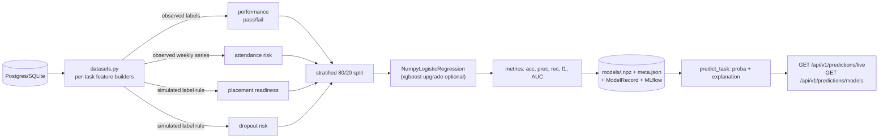

# PHASE 9 — Machine Learning (4 prediction tasks)

> Status: **IMPLEMENTED** — Student Performance, Placement, Attendance, and Dropout
> prediction are built, trained, evaluated, and explained end-to-end. Suite: **22 passed**
> (7 new ML tests).
> **Key design decision:** the runtime is **numpy-only** (`app/ml/models.py`) so training
> works offline with zero heavy dependencies. When `requirements-ml.txt` is installed,
> XGBoost/LightGBM, SHAP/LIME, and MLflow upgrade the same pipeline behind identical
> contracts (lazy imports, documented upgrade points).

---

## 1. Dataset design (incl. Synthetic Data Generator)

The **Synthetic Data Generator** (`synthetic/generator.py`, Phase 3) is the dataset
engine: deterministic (seed), privacy-safe, and embeds **failure patterns** — students
with `gpa < 2.4` and attendance `< 0.55` fail with 80% probability; strong students
(`gpa > 3.0`, attendance `> 0.85`) fail with 10%. Each student generates 3–6
enrollments; **attendance now spans 63 class days (9 weeks)** so the temporal
attendance dataset is valid (changed from 24 days in this phase).

| Task | Grain | Label source |
|------|-------|--------------|
| Performance | enrollment | **Observed** — final grade ≠ F (`results` table) |
| Attendance | student | **Observed** — mean attendance over last 40% of weeks < 0.60 |
| Placement | student | **Simulated** — committee rule v1 + seeded noise (no real data yet) |
| Dropout | student | **Simulated** — retention rule v1 + seeded noise (no real data yet) |

> Simulated labels are explicitly documented per task (`target_note` in meta.json).
> When real placement/dropout records arrive, swap the label source without touching
> the feature layer — the contracts are identical.

---

## 2. The four tasks

### 2.1 Student Performance Prediction

| Aspect | Design |
|--------|--------|
| **Features** | gpa, attendance_rate, prior_grade (letter→score), year, credits, program (one-hot), department (one-hot) |
| **Algorithm** | Logistic regression (numpy) ↔ XGBoost upgrade |
| **Training** | 80/20 stratified split; z-standardize on train fold only; L2 GD, early stop on loss |
| **Evaluation** | accuracy / precision / recall / F1 / ROC-AUC on held-out fold |
| **Explainability** | `linear-logit` contributions (weight × standardized value) |
| **Deployment** | `models/performance.npz` + meta; `predict_task(db, "performance")`; Celery `ml.train_all` |

### 2.2 Attendance Prediction

| Aspect | Design |
|--------|--------|
| **Features** | mean attendance (known window), trend (linear slope), volatility, gpa, year, program, course load |
| **Target** | risk of mean attendance < 0.60 over the **last 40% of weeks** (temporal, no leakage) |
| **Algorithm** | Logistic regression ↔ XGBoost |
| **Training** | stratified split; z-scored features |
| **Evaluation** | standard binary metrics; note single-class folds report AUC = 0.5 (uninformative) |
| **Explainability** | linear-logit contributions (attendance trend/mean dominate) |
| **Deployment** | `models/attendance.npz`; used by the Attendance Agent (Phase 7) 🔜 |

### 2.3 Placement Prediction

| Aspect | Design |
|--------|--------|
| **Features** | gpa, attendance_rate, avg_marks, year, course_load, credits, program (one-hot) |
| **Target (simulated)** | `P(placed) = σ(3.0·gpa/4 + 2.5·att + 1.2·program_boost + 0.3·marks/100 − 3.0) > U(0,1)` |
| **Algorithm** | Logistic regression ↔ XGBoost |
| **Training** | stratified split (class imbalance: ~30% placed) |
| **Evaluation** | accuracy/precision/recall/F1/AUC — recall-oriented for the placement office |
| **Explainability** | linear-logit contributions per student |
| **Deployment** | `models/placement.npz`; feeds the **Placement Agent** (Phase 7) 🔜 |

### 2.4 Dropout Prediction

| Aspect | Design |
|--------|--------|
| **Features** | gpa, attendance_rate, avg_marks, year (freshman flag), course_load, credits, program |
| **Target (simulated)** | `P(dropout) = σ(2.4·(1−att) + 2.0·(1−gpa/4) + 0.8·freshman − 3.6) > U(0,1)` (~6% base rate) |
| **Algorithm** | Logistic regression ↔ XGBoost |
| **Training** | stratified split |
| **Evaluation** | accuracy/precision/recall/F1/AUC |
| **Explainability** | linear-logit; SHAP upgrade point |
| **Deployment** | `models/dropout.npz`; **this is the legacy `risk_model`** — `predict_risk()` (used by `/predictions/live` and the success agent) now routes through it |

---

## 3. Training (`app/ml/train.py`)

- `train_task(task, model_dir, seed, use_booster)` — one pipeline for all tasks.
- `train_all()` — trains the four; `train_model()` — back-compat wrapper (dropout as risk model).
- **Stratified train/test split** (`models.py`) keeps class balance in both folds (critical for the imbalanced placement/dropout targets).
- Persistence: `models/<task>.npz` (weights, scaler, feature names) + `<task>_meta.json` (algorithm, version, metrics, target note) — **no joblib dependency**.
- Registry: `ModelRecord` rows (name=`<task>_model`) → surfaced by `GET /api/v1/predictions/models`.
- MLflow logging is best-effort (`MLFLOW_TRACKING_URI`) and never blocks training.
- CLI: `python -m app.ml.cli train --all | --task T [--booster]`; Celery: `ml.train_all`.

## 4. Prediction & explainability (`app/ml/predict.py`)

- `predict_task(db, task, limit)` — scores the task dataset, sorts by probability, returns per-row: task, student_id, task-specific probability (`dropout_probability`, `pass_probability`, `placement_probability`, `absence_risk`), risk bucket (low/medium/high ≥0.4/≥0.7), `action`, explanation text, **contributions dict**, `model_version`, `explainer`.
- `predict_risk()` — legacy shape (`shap` key preserved) for `/predictions/live` and the StudentSuccess agent.
- **No model trained → deterministic heuristic** (labelled `heuristic-v1`, never silent).
- Explainability: `linear-logit` (weight × standardized feature) — model-agnostic baseline; **SHAP/LIME upgrade point** when `requirements-ml.txt` is installed.

## 5. Verified behaviour

- Demo run (200 students / 15 courses, seed 42): generator inserted 820 enrollments + 26 154 attendance records; all four models trained; dropout explained via `linear-logit` (e.g. `STU00102 0.963 high`).
- `tests/test_ml.py` (7 tests): dataset shapes/labels, stratified split, metrics correctness, LR learns separable rule (>0.85 acc), save/load roundtrip + explainer, full train_all + predict_all, back-compat.

## 6. Implementation order (remaining 🔜)

1. **SHAP/LIME upgrade** — swap `explain_logit` for KernelExplainer/TreeExplainer when installed (same dict shape).
2. **Evaluation harness** — seeded gold sets per task; report MRR/recall@k of the flag lists, model drift tracking.
3. **Real placement/dropout labels** — replace simulated targets when records exist.
4. **Calibration** — isotonic/Platt on probabilities before risk buckets.
5. **Hyperparameter sweeps + cross-validation** — repeated stratified K-Fold for stable metric CIs.
6. **Serving** — model version pinning per environment; auto-refresh via Celery beat.

## 7. FR traceability

| Requirement | Delivered by |
|-------------|--------------|
| Early-warning system | dropout + attendance risk models (live endpoint) |
| Placement readiness intelligence | placement model feeding Placement Agent |
| Explainable decisions | linear-logit contributions on every prediction; SHAP ready |
| Offline/privacy-friendly ML | numpy-only training; local models; no external calls |
| Reproducibility | seeded generator + seeded splits + versioned artifacts |
