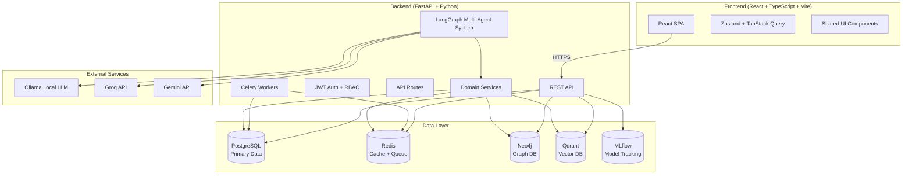
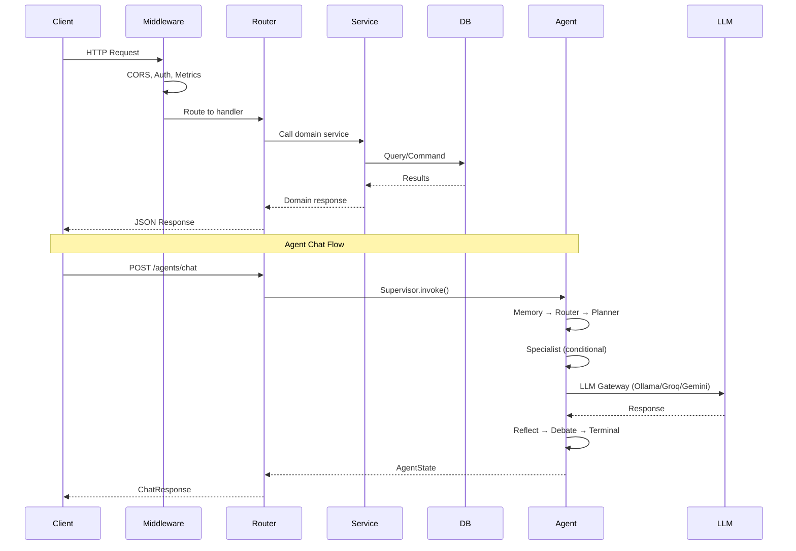
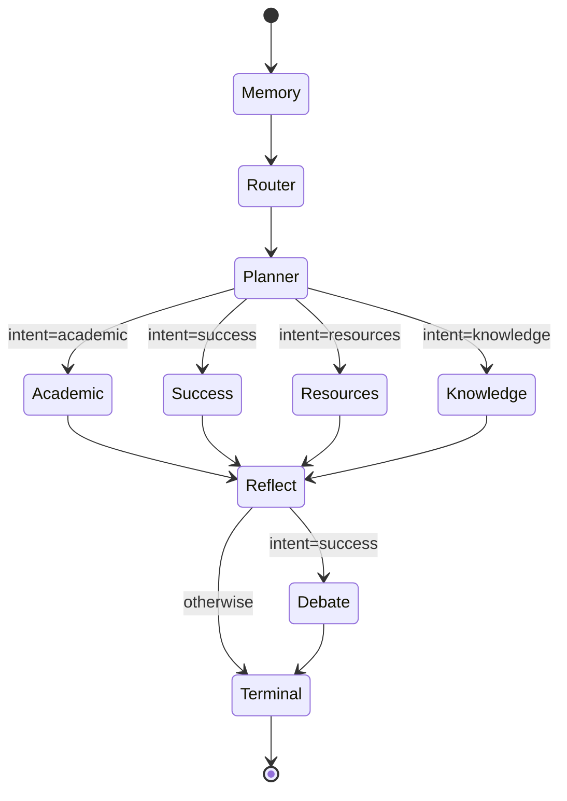
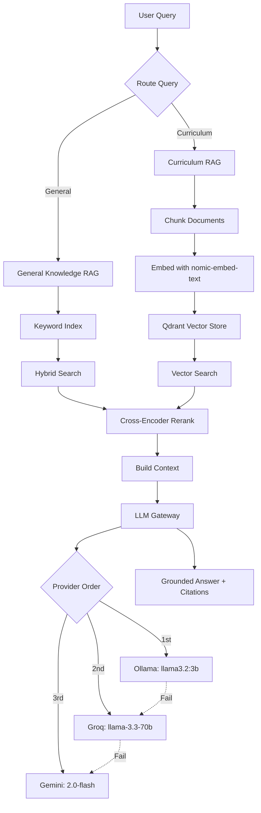
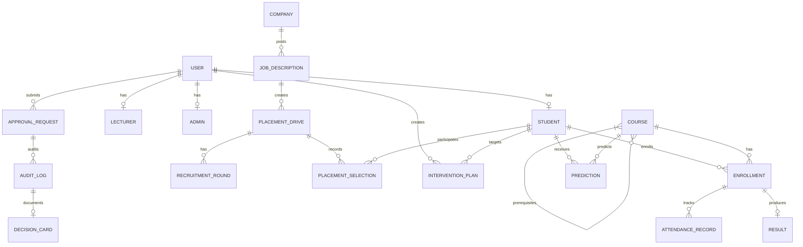
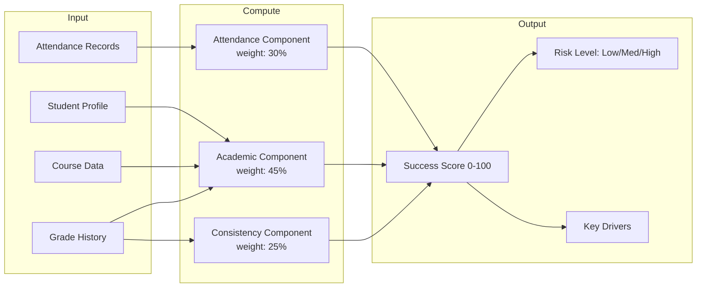
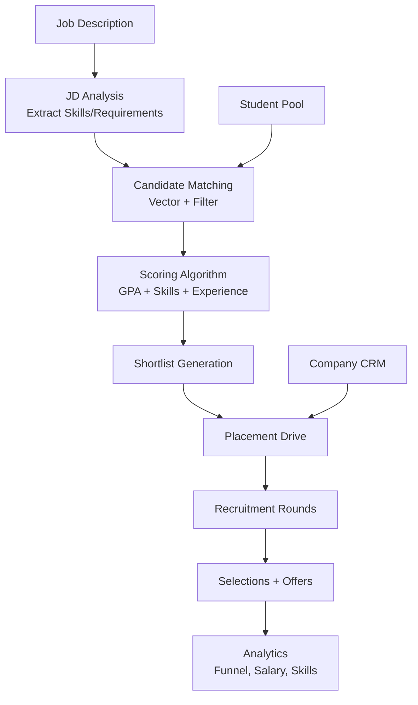
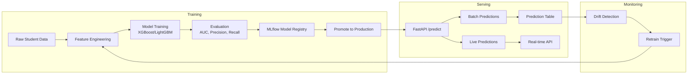
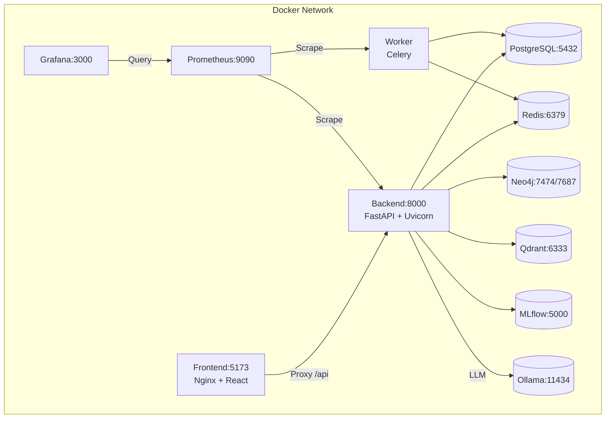

# Beru Campus AI - Architecture Documentation

## System Overview

Beru Campus AI is a multi-tenant, role-based campus intelligence platform with three primary user personas:
- **Students** - Academic copilot, success analytics, AI-powered tools
- **Faculty** - Course management, intervention system, AI teaching assistants
- **Placement Officers** - Drive management, job matching, analytics

---

## High-Level Architecture



---

## Backend Architecture

### Module Structure

```mermaid
graph TD
    Main[main.py] --> Config[config.py]
    Main --> DB[db.py]
    Main --> Lifespan[Lifespan Events]
    
    Lifespan --> SeedAdmin[Seed Admin]
    Lifespan --> SeedUsers[Seed Demo Users]
    Lifespan --> SeedKB[Seed Knowledge Base]
    Lifespan --> SeedCurriculum[Seed Curriculum KB]
    
    API[API Routes] --> Auth[auth.py]
    API --> Students[students.py]
    API --> Faculty[faculty.py]
    API --> Placement[placement.py]
    API --> Agents[agents.py]
    API --> Admin[admin_module.py]
    API --> Health[health.py]
    API --> Predictions[predictions.py]
    API --> Notifications[notifications.py]
    API --> Approvals[approvals.py]
    API --> Audit[audit.py]
    API --> Synthetic[synthetic.py]
    
    Services[Services] --> StudentsSvc[students.py]
    Services --> StudentGrowth[student_growth.py]
    Services --> StudentTools[student_tools.py]
    Services --> FacultySvc[faculty.py]
    Services --> FacultyIntel[faculty_intelligence.py]
    Services --> FacultyTools[faculty_tools.py]
    Services --> PlacementSvc[placement.py]
    Services --> PlacementIntel[placement_intelligence.py]
    Services --> Prereqs[prereqs.py]
    Services --> Pipeline[pipeline.py]
    Services --> RAG[rag.py]
    Services --> CurriculumRAG[curriculum_rag.py]
    Services --> VectorStore[vector_store.py]
    Services --> LLM[llm.py]
    Services --> Notifications[notifications.py]
    Services --> Graph[graph_service.py]
    Services --> ML[predict.py]
    
    Agents[LangGraph Agents] --> Supervisor[supervisor.py]
    Agents --> Base[base.py]
    Agents --> Academic[academic_ops.py]
    Agents --> Specialists[specialists.py]
    Agents --> Debate[debate.py]
    Agents --> Execute[execute.py]
    Agents --> Memory[memory.py]
    Agents --> State[state.py]
    
    ML[ML Pipeline] --> Train[train.py]
    ML --> Predict[predict.py]
    ML --> Features[features.py]
    ML --> Models[models.py]
    ML --> Optimize[optimize.py]
    ML --> Datasets[datasets.py]
```



### Request Flow



---

## Multi-Agent System (LangGraph)

### Supervisor Graph



### Agent Specializations

| Agent | Responsibility | Tools |
|-------|---------------|-------|
| **AcademicOps** | Course ops, enrollment, timetable | SQL, Prereq Graph |
| **StudentSuccess** | Risk prediction, interventions | ML Models, Analytics |
| **ResourceOptimizer** | Room allocation, scheduling | OR-Tools, Neo4j |
| **Knowledge** | Curriculum RAG, graph queries | Qdrant, Neo4j, Cypher |

### Reflection & Debate Nodes

```mermaid
flowchart TD
    Reflect[Reflect Node] --> Checks{Validation Checks}
    Checks --> Empty[Empty Answer?]
    Checks --> Uncertainty[Admitted Uncertainty?]
    Checks --> Approval[Requires Approval?]
    Checks --> Citations[Has Citations?]
    
    Empty -.->|Yes| Conf[Confidence -= 0.40]
    Uncertainty -.->|Yes| Conf2[Confidence -= 0.15]
    Approval -.->|Yes| Conf3[Confidence = min(0.70)]
    Citations -.->|No| Conf4[Confidence -= 0.10]
    
    Conf --> Output[Findings + Confidence]
    Conf2 --> Output
    Conf3 --> Output
    Conf4 --> Output
    
    Output --> Debate{intent=success?}
    Debate -->|Yes| DebateNode[Debate Node]
    Debate -->|No| Terminal[Terminal Node]
    DebateNode --> Terminal
```

---

## RAG Pipeline



---

## Database Schema (Key Entities)



---

## Data Flow: Student Success Score



---

## Placement Intelligence Flow



---

## ML Pipeline



---

## Security Architecture

```mermaid
flowchart TD
    Client[Client] --> TLS[TLS Termination]
    TLS --> CORS[CORS Middleware]
    CORS --> Auth[JWT Authentication]
    Auth --> RBAC[Role-Based Access]
    RBAC --> RateLimit[Rate Limiting]
    RateLimit --> Routes[API Routes]
    
    Routes -->|Student| StudentAPI[/students/*]
    Routes -->|Faculty| FacultyAPI[/faculty/*]
    Routes -->|Placement| PlacementAPI[/placement/*]
    Routes -->|Admin| AdminAPI[/admin/*]
    
    Auth --> TokenGen[Access + Refresh Tokens]
    TokenGen --> Store[HttpOnly Cookies / Header]
    Store --> Validate[Token Validation]
    Validate --> Claims[Extract Claims]
    Claims --> Permissions[Check Permissions]
```

---

## Deployment Architecture (Docker Compose)



---

## Key Design Decisions

| Decision | Rationale |
|----------|-----------|
| **LangGraph for Agents** | Explicit state machines, auditability, human-in-the-loop |
| **Hybrid RAG (Keyword + Vector)** | Better recall for curriculum-specific queries |
| **Neo4j for Prerequisites** | Natural graph representation, efficient traversal |
| **Celery for Async** | Reliable task queue, retries, scheduling |
| **MLflow for Models** | Experiment tracking, versioning, deployment |
| **Zustand + TanStack Query** | Lightweight state, server cache synchronization |
| **UUID Primary Keys** | Distributed-friendly, no sequence conflicts |
| **Audit Log + Decision Cards** | Full traceability for compliance/grading |

---

## Future Extensibility Points

1. **Plugin System** - New agent specialists via LangGraph nodes
2. **Webhook Framework** - External integrations (LMS, HRIS)
3. **Multi-Tenancy** - Schema-per-tenant or row-level security
4. **Event Sourcing** - Full audit trail with event replay
5. **GraphQL Gateway** - Flexible data fetching for mobile apps
6. **Real-time** - WebSocket for live dashboards/notifications

---

*Generated for Beru Campus AI Final Year Project*